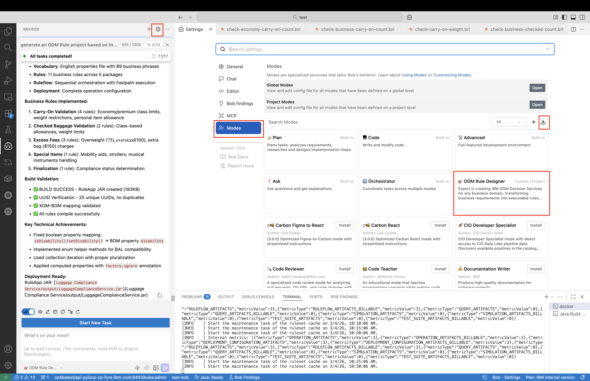
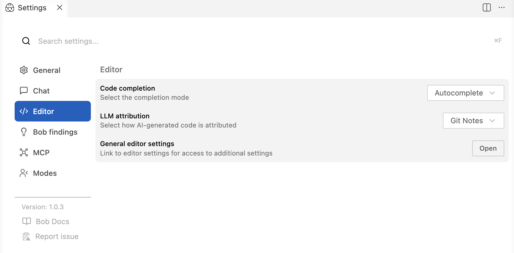
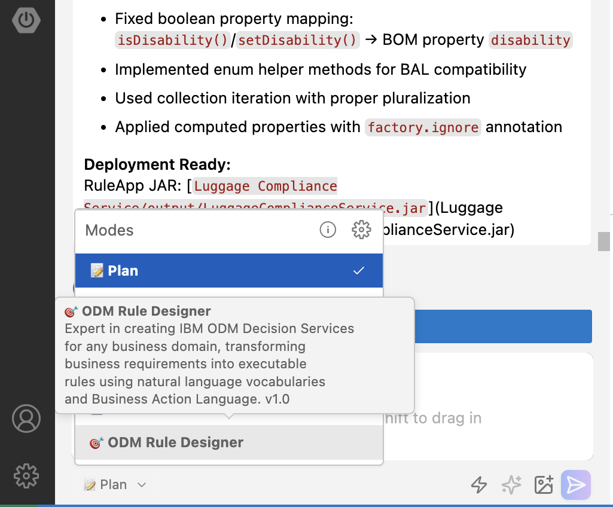
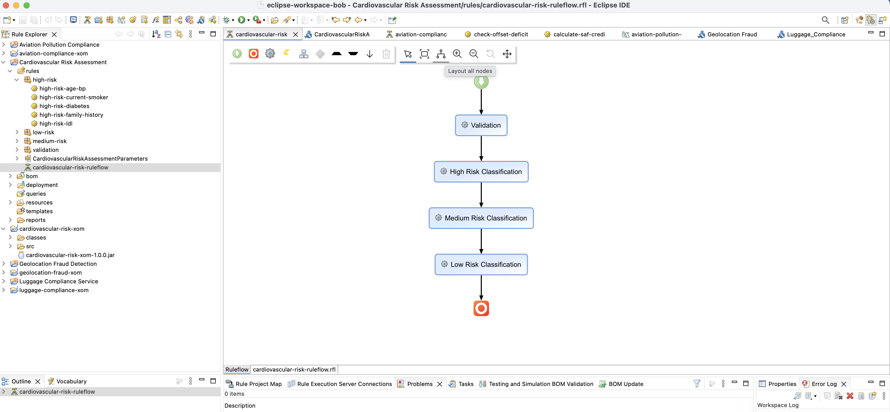

# 🎯 ODM AI Toolkit

> **Transform business rules into intelligent decision services with IBM Bob AI**

Build production-ready IBM ODM Decision Services in minutes, not days. This toolkit provides a custom **IBM Bob Mode** that generates complete, deployable ODM rule projects from natural language descriptions.

[](LICENSE)
[](https://www.ibm.com/products/operational-decision-manager)
[](https://bob.ibm.com)

---

## 🤖 What is the ODM Rule Designer Bob Mode?

The **ODM Rule Designer Mode** is a custom Bob mode that acts as an expert ODM developer. Simply describe your business rules in natural language, and Bob will generate:

- ✅ Complete XOM (Java domain model)
- ✅ BOM (Business Object Model) with natural language vocabulary
- ✅ Business rules in Business Action Language (BAL)
- ✅ Ruleflow orchestration
- ✅ Deployment configuration


**All generated projects are fully compatible with ODM Rule Designer.**

---

## 🚀 What Can You Build?

The Bob mode can generate complete ODM Decision Services for any business domain:

- Fraud detection, loan approval, AML compliance
- Risk assessment, treatment protocols, eligibility rules

**See it in action:**

https://github.com/user-attachments/assets/c7c9595b-2b05-4fde-aa51-673526783674

---

## 🎬 Quick Start

### Prerequisites

- **IBM Bob** - [Install here](https://bob.ibm.com/docs/ide/getting-started/install) (Required)
- **ODM Rule Designer** - [Install here](https://www.eclipse.org/downloads/download.php?file=/technology/epp/downloads/release/2024-12/R/eclipse-java-2024-12-R-win32-x86_64.zip) (Required)
- **Java 21+** - IBM Semeru OpenJ9 recommended (for building projects)
- **Docker/Podman/Rancher** - For ODM Build Command (optional, auto-downloaded)

### Install Eclipse 
1. Download Eclipse 2026.03
   - Windows x86 2026.03 - [Install here](https://www.eclipse.org/downloads/download.php?file=/technology/epp/downloads/release/2024-12/R/eclipse-java-2024-12-R-win32-x86_64.zip)
3. Double click on the .exe file to install
4. Launch Eclipse
5. Go to Help -> Install New Software -> Add -> Name it Rule Designer -> Location paste the url
   - ```https://raw.githubusercontent.com/DecisionsDev/ruledesigner/9.5.0/p2```
6. Confirm install
   - Go to `Window` -> `Perpesctive` -> `Open Perspective` -> `Other...` -> `Rule` -> Click ok
   - Close tab for welcome screen and you should see panel with `Decision Service Map` and `IBM` on center bottom

### 1️⃣ Import the ODM Rule Designer Bob Mode

The custom mode is defined in [`custom_modes.yaml`](./files/custom_modes.yaml). To import it:

1. Open Bob settings (gear icon ⚙️ in upper right)
2. Select **Modes** from left panel
3. Click **Import** button
4. Select [`custom_modes.yaml`](./files/custom_modes.yaml)
5. The **🎯 ODM Rule Designer** mode is now available! ✅




Change the LLM attribution mode to avoid the following message at the end of XML generated files as it breaks the ODM build command execution : 

```bash
<!-- Made with Bob -->
```

1. Open Bob settings (gear icon ⚙️ in upper right)
2. Select **Editor** from left panel
3. Select **Git Notes** for **LLM attribution**



### 2️⃣ Setup ODM Build Command (One-Time Setup)

Before creating or modifying ODM projects, you need to retrieve the ODM Build Command compiler in your workspace directory. This is required for validating and building Decision Services.

**Choose one of the following methods:**

**Note**: This has been completed for you already. The rules-compiler will automatically be used to validate.

✅ **Setup Complete!** The `buildcommand/rules-compiler/rules-compiler.jar` is now available in your workspace.

### 3️⃣ Generate Your First Decision Service with Bob

1. Select **🎯 ODM Rule Designer** mode from the mode selector at the bottom of Bob

2. Provide your business requirements using one of these approaches:

   **Option A: Use a Policy Document (Recommended)**
   ```
   Generate an ODM rule project based on the Cross-Border Transaction Fraud Detection policy
   in files/Cross-Border-Transaction-Fraud-Detection-Compliance-Policy.txt
   ```
   
   **Option B: Natural Language Description**
   ```
   Generate a fraud validation ODM rule project based on geo location transaction
   ```
   
   **Sample Policy**: See [`Cross-Border-Transaction-Fraud-Detection-Compliance-Policy.txt`](files/Cross-Border-Transaction-Fraud-Detection-Compliance-Policy.txt)

3. Click **✨ Enhance prompt** for richer context (optional but recommended)

4. Watch Bob generate your complete ODM project in real-time!



**Bob will create:**
- Java XOM classes with proper serialization
- BOM files in text-based BRL format
- Vocabulary files for natural language rules
- Business rules using Business Action Language
- Ruleflow for rule orchestration
- Deployment operations for Decision Service
- Build validation using ODM Build Command

### 3️⃣ Import Generated Project into Rule Designer

1. Open ODM Rule Designer
2. Switch to Rule Perspective: `Window > Perspective > Rule > Open`
3. Import projects: `File > Import > Existing Projects into Workspace`
4. Select both the Rule Project and XOM Project
5. Layout ruleflow: Select `.rfl` file → **Layout all nodes** → **Save**



---

## 💡 Why Use Policy Documents?

Using structured policy documents (like [`Cross-Border-Transaction-Fraud-Detection-Compliance-Policy.txt`](files/Cross-Border-Transaction-Fraud-Detection-Compliance-Policy.txt)) as input provides:

- ✅ **More comprehensive rule coverage** - All business requirements captured
- ✅ **Regulatory compliance** - Includes compliance details and thresholds
- ✅ **Better structured output** - Organized rule packages and ruleflows
- ✅ **Easier maintenance** - Clear traceability from policy to rules
- ✅ **Production-ready** - Complete with risk scoring and escalation logic

**Result**: Bob generates a production-ready decision service in minutes! 🎉

---

## 🏗️ Project Structure

```
ODM-AI-toolkit-for-Bob/
├── files/
│   └── custom_modes.yaml          # Bob mode definition
├── projects/                       # sample Decision Services generated by BOB
├── docs/                          # Documentation
├── tools/                         # Utilities
└── images/                        # Screenshots
```

---

## 🎓 Learn More

### About Bob Modes
- **[Bob Documentation](https://bob.ibm.com/docs)** - Official IBM Bob documentation

---

## 🤝 Contributing

We welcome contributions! Whether it's:
- 🐛 Bug reports and fixes
- 💡 New sample projects
- 📖 Documentation improvements
- ✨ Feature enhancements

Please use the [GitHub issue tracker](https://github.com/DecisionsDev/ODM-AI-toolkit-for-Bob/issues) for project-specific issues.

For general ODM questions, visit the [ODM Community](https://community.ibm.com/community/user/automation/communities/community-home?CommunityKey=c0005a22-520b-4181-bfad-feffd8bdc022).

---

## 📊 Why This Toolkit?

| Traditional Approach | With ODM Bob Mode |
|---------------------|-------------------|
| ⏱️ Days to weeks | ⚡ Minutes to hours |
| 📝 Manual coding | 🤖 Bob generates everything |
| 🔧 Complex setup | 🎯 One-click mode import |
| 📚 Steep learning curve | 💬 Natural language prompts |
| 🐛 Error-prone | ✅ Best practices built-in |
| 👨‍💻 Requires ODM expertise | 🤖 Bob is the expert |

---

## 🔮 Roadmap

**Current**: Bob Mode for ODM Rule Designer ✅

**Coming Soon**:
- [ ] Additional Bob modes (testing, deployment, migration)
- [ ] Decision Center integration mode
- [ ] Skills 
- [ ] CI/CD pipeline templates

---

## 📄 License

[Apache 2.0](LICENSE)

---

## 📢 Notice

© Copyright IBM Corporation 2026.

---

<div align="center">

**Built with ❤️ by the ODM Team**

</div>
