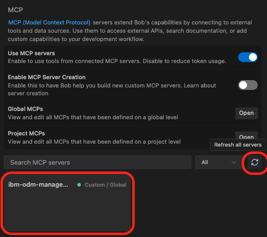
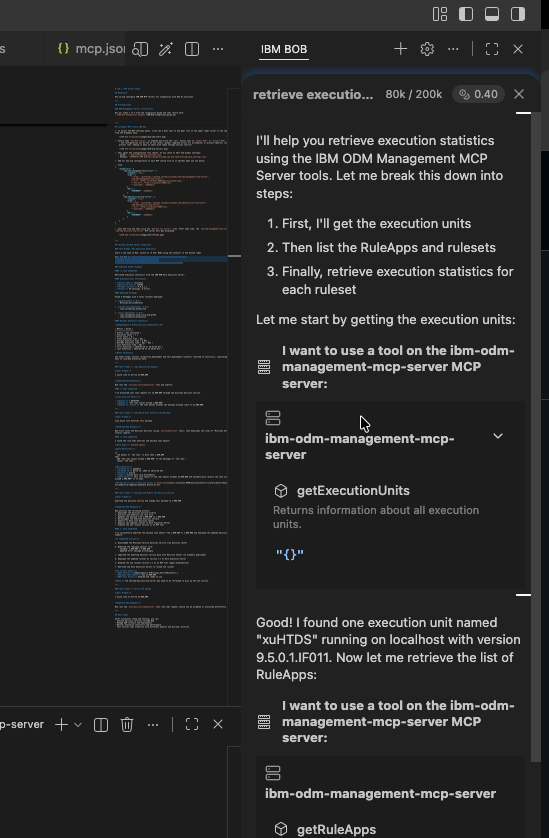
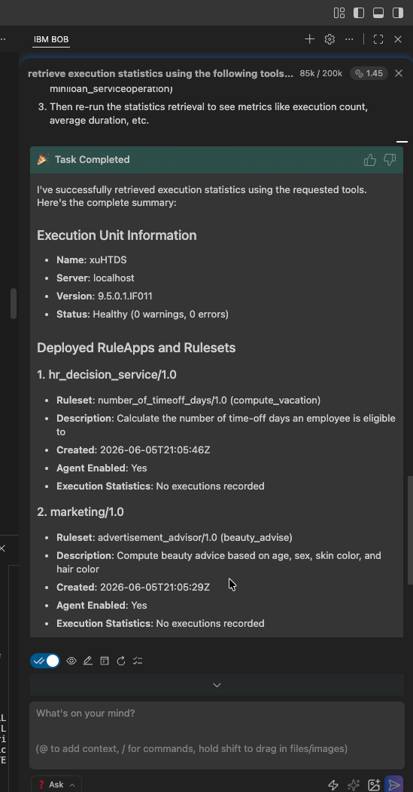
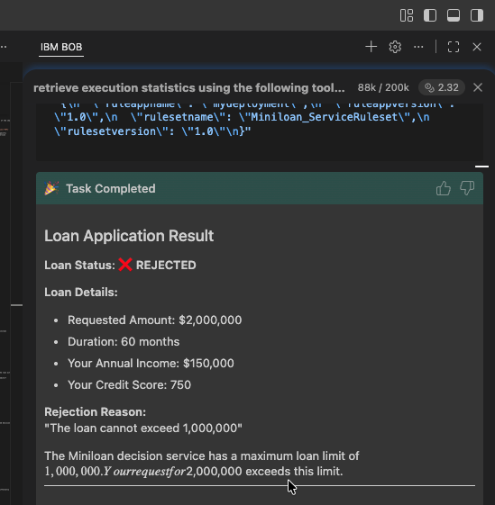
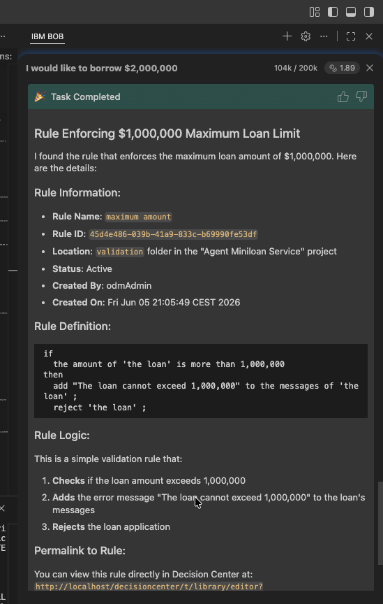

# Lab 1: MCP Server Setup for IBM ODM

## Objective

Set up and configure IBM ODM MCP servers to enable Bob AI assistant to interact with your IBM Operational Decision Manager (ODM) environment. This integration allows Bob to manage decision services, execute rules, and analyze execution statistics through natural language commands.

---

## Prerequisites

### ODM Management Server Installation

Before starting this lab, you must complete the ODM server setup:

1. Follow **Steps 1-5** from the [IBM Bob Integration Guide](./IBM-Bob-integration-guide.md)
2. Ensure your ODM server is running on `http://localhost:9060`
3. Verify you can access the Decision Center at `http://localhost:9060/decisioncenter`

Once complete, return here to configure the MCP servers in Bob.

---

## Part 1: Configure MCP Servers in IBM Bob

### What are MCP Servers?

MCP (Model Context Protocol) servers extend Bob's capabilities by connecting it to external systems. In this lab, we'll configure two MCP servers:
- **ibm-odm-management-mcp-server**: Manages ODM rulesets, deployments, and configurations
- **ibm-odm-decision-mcp-server**: Executes decision services and rules

### Step 1: Access MCP Settings

1. In the Bob chat window, click the **three dots (⋮)** next to the gear icon in the upper right corner
2. Select **MCP servers** from the dropdown menu

   

### Step 2: Choose Configuration Scope

1. Ensure **Use MCP servers** is enabled (toggle should be on)
2. Click the **Open** button next to either to open the right json:
   - **Global MCPs**: Configuration applies to all your workspaces (recommended for personal use)
   - **Project MCPs**: Configuration stored in `.bob/mcp.json` within your project (recommended for team sharing)

   

   > **💡 Tip**: Use Global MCPs if you're working alone. Use Project MCPs if you want to share the configuration with your team through version control.

The json configuration file will now be open in your editor:
- **macOS (Global)**: `~/.bob/settings/mcp_settings.json`
- **Windows (Global)**: `%APPDATA%\IBM Bob\User\globalStorage\ibm.bob-code\settings\mcp_settings.json`
- **Project**: `.bob/mcp.json` in your project root

### Step 3: Add MCP Server Configuration

Modify or replace the entire contents of the configuration file with the following JSON:

```json
{
    "mcpServers": {
        "ibm-odm-management-mcp-server": {
            "command": "uvx",
            "args": [
                "--from", "git+https://github.com/DecisionsDev/ibm-odm-management-mcp-server", 
                "ibm-odm-management-mcp-server",
                "--url", "http://localhost:9060/decisioncenter-api",
                "--res-url", "http://localhost:9060/res",
                "--username", "odmAdmin"
            ],
            "env": {
                "PASSWORD": "odmAdmin"
            }
        },
        "ibm-odm-decision-mcp-server": {
            "command": "uvx",
            "args": [
                "--from", "git+https://github.com/DecisionsDev/ibm-odm-decision-mcp-server", 
                "ibm-odm-decision-mcp-server",
                "--url", "http://localhost:9060/res",
                "--username", "odmAdmin"
            ],
            "env": {
                "PASSWORD": "odmAdmin"
            }
        }
    }
}
```

> **⚠️ Important**: This configuration uses default credentials (`odmAdmin`/`odmAdmin`). In production environments, use secure credentials and environment variables.

### Step 5: Activate the MCP Servers

1. **Save** the configuration file
2. Return to the MCP servers panel in Bob
3. Click the **Refresh all servers** icon (circular arrow)
4. Wait a few moments for the servers to initialize
5. Verify both servers appear in the list:
   - `ibm-odm-management-mcp-server`
   - `ibm-odm-decision-mcp-server`

   

> **💡 Tip**: If the servers don't appear, check the Bob logs for connection errors. Ensure your ODM server is running and accessible.

---

## Part 2: Testing the MCP Server Connection

Now let's verify the integration works correctly by running a series of test prompts.

### Test 1: Retrieve Execution Statistics

**Purpose**: Verify Bob can connect to ODM and retrieve system information.

#### Instructions:

1. Start a new conversation in Bob
2. Switch to **"❓ Ask" mode** using the mode selector in the bottom right corner
3. Enter the following prompt:

```
retrieve execution statistics using the following tools:
- `getExecutionUnits` - Find execution units
- `getRuleApps` - List RuleApps and rulesets
- `getRulesetStatistics` - Get execution statistics for each ruleset
```

#### What to Expect:

Bob will request permission to use the MCP tools:



Click **"Approve"** to allow Bob to proceed.

#### Expected Output:

Bob should display execution unit information, deployed RuleApps, and their rulesets:



> **✅ Success Indicator**: You should see information about the `xuHTDS` execution unit and three deployed RuleApps (hr_decision_service, marketing, and mydeployment).

---

### Test 2: Execute a Decision Service

**Purpose**: Test Bob's ability to execute ODM decision services through natural language.

#### Instructions:

Enter this prompt:

```
I would like to borrow $2,000,000
```

If Bob asks for additional information (loan duration, income, credit score), select one of the suggested options or provide your own values.

#### What to Expect:

Bob will:
1. Recognize this as a loan application request
2. Use the `miniloan_serviceoperation` tool
3. Execute the Miniloan decision service
4. Return the loan approval decision

#### Expected Output:



The loan should be **rejected** with the message: *"The loan cannot exceed 1,000,000"*

> **💡 What's Happening**: The Miniloan decision service has a business rule that limits loans to $1,000,000. Bob executed this rule and returned the decision.

---

### Test 3: Discover Business Rules

**Purpose**: Show how Bob can analyze and explain business rules in ODM.

#### Instructions:

Continue the conversation with:

```
find which rule enforces this maximum
```

#### What to Expect:

Bob will:
1. List available decision services using the `decisionServices` tool
2. Download the Miniloan Service rules using the `rules` tool
3. Analyze the rules to find the one enforcing the maximum
4. Present the rule details in a readable format

#### Expected Output:



> **✅ Success Indicator**: Bob should identify the "maximum amount" rule and display its logic in plain English.

---

### Test 4: Modify and Deploy Business Rules

**Purpose**: Demonstrate Bob's ability to modify ODM rules and deploy changes.

#### Instructions:

Enter this prompt:

```
download the decision service and change this maximum to 2,000,000
```

#### What to Expect:

Bob will perform a complete DevOps workflow:
1. Download the decision service archive from Decision Center
2. Extract and locate the rule file
3. Modify the maximum amount from 1,000,000 to 2,000,000
4. Update the error message accordingly
5. Re-package the decision service
6. Import it back into Decision Center
7. Deploy the updated ruleset (version 1.1) to Rule Execution Server
8. Enable the new version as an MCP tool

**Important:** You will need to open the MCP panel within Bob and click refresh on the MCP to ensure that the new rules are being utilized properly. Otherwise, you may be referring to an old cached ruleset.

#### Expected Output:

```
🎉 Task Completed

I've successfully modified the maximum loan amount from 1,000,000 to 2,000,000 
and deployed the updated decision service.

✅ Completed Actions:

a. Downloaded the Miniloan Service decision service from Decision Center

b. Modified the "maximum amount" rule:
   - Changed: 1,000,000 → 2,000,000
   - Updated error message accordingly

c. Imported the modified decision service back into Decision Center 
   (15 elements published)

d. Deployed the updated ruleset as version 1.1 to Rule Execution Server

e. Enabled the new ruleset version 1.1 as an MCP tool (agent.enabled=true)

f. Notified the Rule Execution Server to reload the ruleset

📋 Current Status:
- New Ruleset: mydeployment/1.0/Miniloan_ServiceRuleset/1.1
- Maximum Loan Amount: Now $2,000,000
- MCP Tool Status: Enabled and ready to use

Note: The ibm-odm-decision-mcp-server may need to be refreshed to pick up 
the new version.
```

> **💡 What's Happening**: Bob just performed a complete rule modification and deployment cycle—something that typically requires multiple manual steps in Decision Center and Rule Execution Server.

---

### Test 5: Verify the Rule Change

**Purpose**: Confirm the modified rule is working correctly.

#### Instructions:

Test the same loan amount again:

```
I would like to borrow $2,000,000
```

#### What to Expect:

Bob will execute the `miniloan_serviceoperation` tool using the **new version 1.1** of the ruleset.

#### Expected Output:

The loan should now be **approved** (or processed differently) since the maximum has been increased to $2,000,000.

> **✅ Success Indicator**: The loan is no longer rejected for exceeding the maximum amount.

---

## Troubleshooting

### MCP Servers Not Appearing

- Verify your ODM server is running: `http://localhost:9060/decisioncenter`
- Check the configuration file syntax (valid JSON)
- Review Bob's logs for connection errors
- Ensure `uvx` is installed (comes with Python's `uv` package manager)

### Permission Denied Errors

- Verify credentials in the configuration file
- Check that `odmAdmin` user has appropriate permissions in ODM

### Tools Not Working

- Refresh the MCP servers using the refresh icon
- Restart Bob
- Verify the ODM server is accessible from your machine

---

## Next Steps

Congratulations! You've successfully integrated IBM Bob with IBM ODM. You can now:

- **Execute decision services** through natural language conversations
- **Manage ODM rulesets and deployments** without using the web console
- **Monitor execution statistics and performance** by asking Bob
- **Modify business rules** and deploy changes conversationally
- **Test various scenarios** with different loan amounts and borrower profiles

### Explore More

Try these additional prompts to explore Bob's capabilities:
- "Show me all deployed decision services"
- "What are the execution statistics for the vacation service?"
- "Download the beauty advisory service and show me its rules"
- "Deploy a new version of the hr_decision_service"

### Learn More

- [IBM ODM Documentation](https://www.ibm.com/docs/en/odm)
- [MCP Protocol Specification](https://modelcontextprotocol.io/)
- [IBM Bob Documentation](https://ibm.github.io/ibm-bob-code/)

---

**Lab Complete!** 🎉

You've learned how to set up MCP servers, execute decision services, analyze business rules, and modify ODM configurations—all through natural language with Bob.
