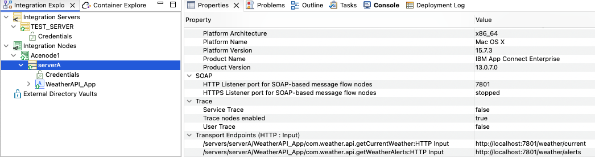
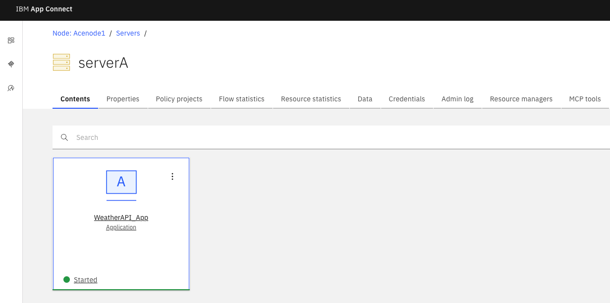
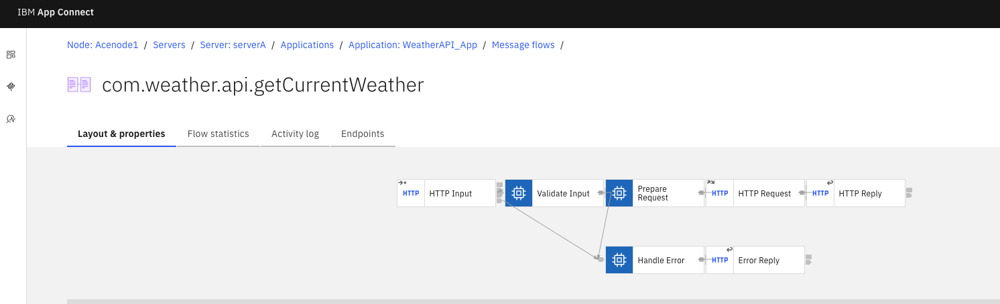
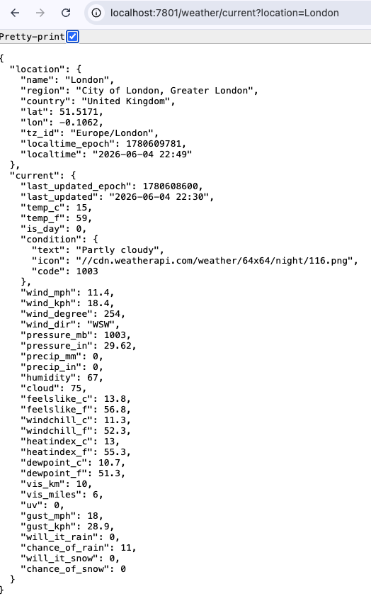
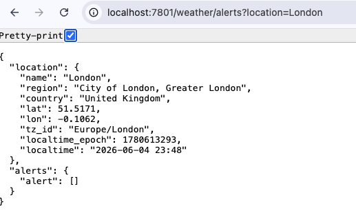
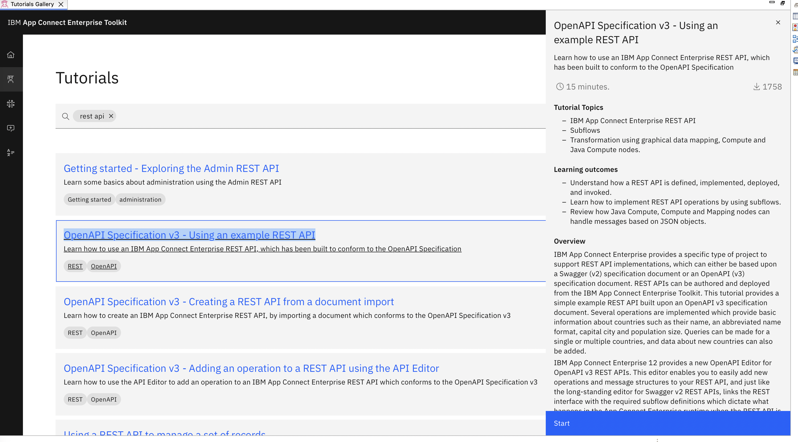
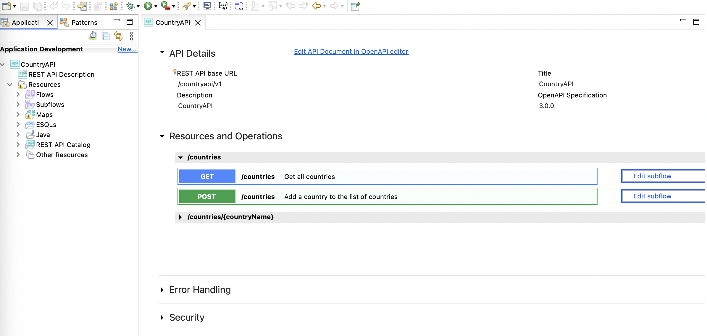
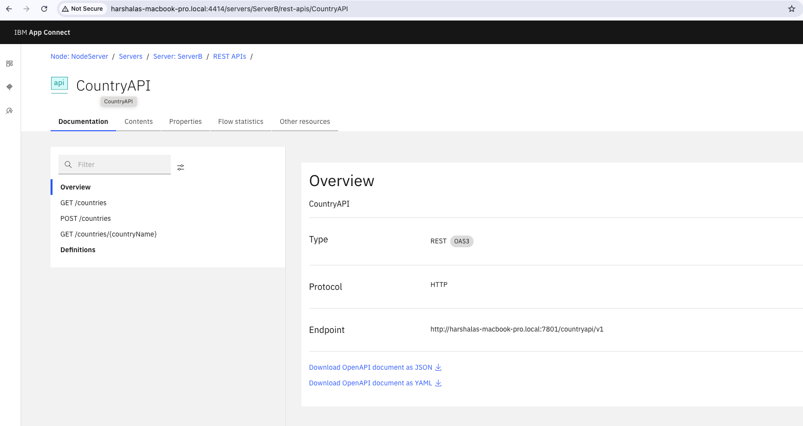

# IBM Bob IDE Labs for App Connect Enterprise Toolkit

## Overview

[Build integration projects faster with IBM Bob and App Connect Enterprise](https://developer.ibm.com/tutorials/accelerate-integration-development-app-connect-ibm-bob/)

## Prerequisites

Before starting these labs, ensure you have the following installed and configured:

### Required Software

1. **IBM App Connect Enterprise Toolkit** (version 13.0.7.0 or later)
   - Download from [IBM Fix Central](https://www.ibm.com/support/fixcentral/)
   - Ensure the toolkit is properly installed and configured

2. **IBM Bob IDE**
   - Install the Bob IDE extension or standalone application
   - Configure Bob with ACE Developer mode

3. **Java Development Kit (JDK)**
   - JDK 8 or later (required for ACE Toolkit)
   - Set JAVA_HOME environment variable

### System Requirements

- **Operating System:** Windows, Linux, or macOS
- **Memory:** Minimum 4GB RAM (8GB recommended)
- **Disk Space:** At least 2GB free space for installation
- **Network:** Internet connection for downloading resources and accessing remote servers

### Optional Tools

- **Web Browser:** Chrome, Firefox, or Edge (for accessing Web UI)
- **API Testing Tool:** Postman or cURL (for testing endpoints)
- **Git:** For version control (optional)

**Note:** Complete all prerequisites before starting the labs.

---

## Lab 1: Build Integration Projects with IBM Bob

Follow these steps to complete Lab 1:

### Step 1: Create an App Connect Enterprise Integration Server

Create an App Connect Enterprise integration server to host your integration applications.

### Step 2: Import the ACE Developer Mode into the Bob IDE

Import the ACE Developer mode into the Bob IDE to enable integration development capabilities.

### Step 3: Create an App Connect Enterprise Integration Project Using IBM Bob

Use IBM Bob to create a new App Connect Enterprise integration project.

### Step 4: Validate and Test the Integration Project in the App Connect Enterprise Toolkit

Validate and test your integration project using the App Connect Enterprise Toolkit.

### Step 5: Create an Integration Node

To create an Integration Node (formerly known as a Broker) in IBM App Connect Enterprise (ACE):

**Create Integration Node:**

```bash
mqsicreatebroker <IntegrationNodeName>
```

**Start the integration node:**

```bash
mqsistart <IntegrationNodeName>
```

**Create an integration server targeting your node:**

```bash
ibmint create server <YourServerName> --integration-node <IntegrationNodeName>
```

**OR**

**Using the IBM App Connect Enterprise Toolkit:**

- Navigate to the Integration Explorer or Integration Nodes view
- Expand your workspace to locate the specific integration node
- Right-click the integration node and select **New Integration Server**
- Type your desired name in the Integration Server name dialog box
- Click **OK** to provision the server under that specific node

### Step 6: Deploy a BAR File to an Integration Server

To deploy a BAR (Broker Archive) file to an integration server:

- Navigate to the Integration Nodes view pane
- Ensure your target Integration Node and Integration Server are started
- Choose one of these quick placement actions:
  - **Drag and drop:** Drag the BAR file from your workspace directly onto the target integration server
  - **Right-click Deploy:** Right-click the BAR file, select **Deploy**, choose your target integration node/server, and click **Finish**



### Step 7: Test the Deployment

**Launch the Web UI:**

Right-click your target integration node to launch the Web UI.





**Access the deployed API:**

Test your deployed integration using the following endpoints:

**Current weather endpoint:**

```
http://<server-ip-or-hostname:port>/weather/current?location=London
```

Example:

```
http://localhost:7801/weather/current?location=London
```



**Weather alerts endpoint:**

```
http://<server-ip-or-hostname:port>/weather/alerts?location=London
```

Example:

```
http://localhost:7801/weather/alerts?location=London
```



---

## Lab 2: MCP Server

### Prerequisites

- Ensure your IBM App Connect Enterprise Integration Node is up and running
- Ensure the App Connect Dashboard (Web UI) is initialized and connected to manage your target integration runtimes/nodes

### Setup Steps

#### Step 1: Access the Tutorials Gallery

- Open your IBM App Connect Enterprise Toolkit
- Click **Help** in the top menu bar
- Select **Tutorials Gallery** from the drop-down menu
- Locate the **OpenAPI Specification v3 - Using an example REST API** tutorial from the catalog



- Follow the steps in the tutorial to import and prepare for deployment



#### Step 2: Create an Integration Node

To create an Integration Node (formerly known as a Broker) in IBM App Connect Enterprise (ACE):

**Create Integration Node:**

```bash
mqsicreatebroker <IntegrationNodeName>
```

**Start the integration node:**

```bash
mqsistart <IntegrationNodeName>
```

**Create an integration server targeting your node:**

```bash
ibmint create server <YourServerName> --integration-node <IntegrationNodeName>
```

#### Step 3: Deploy a BAR File to an Integration Server

To deploy a BAR (Broker Archive) file to an integration server:

- Navigate to the Integration Nodes view pane
- Ensure your target Integration Node and Integration Server are started
- Choose one of these quick placement actions:
  - **Drag and drop:** Drag the BAR file from your workspace directly onto the target integration server
  - **Right-click Deploy:** Right-click the BAR file, select **Deploy**, choose your target integration node/server, and click **Finish**

#### Step 4: Create and Configure an MCP Server

Create a Model Context Protocol (MCP) server to enable Bob IDE integration with your App Connect Enterprise deployment.

##### 4.1: Access the Web UI from the Toolkit

1. **Open the Toolkit:** Launch the IBM App Connect Enterprise Toolkit and switch to the Integration Development perspective
2. **Locate the Node:** Go to the Integration Explorer view (usually located on the bottom left panel)
3. **Connect to the Node:** Ensure your integration node is active and connected
4. **Verify Server Status:** Ensure your Integration Server is active and running
5. **Launch the Web UI:** Right-click your target integration node and select **Start Web User Interface**
6. **Locate the Application:** In the dashboard, find your deployed application in the server list



##### 4.2: Create the MCP Server in ACE Dashboard

1. **Navigate to MCP Server:** Click on **MCP Server** in the menu on the dashboard
2. **Create New Server:** Click **Create an MCP Server**
3. **Select Server:** Choose the server name from your deployed application server
4. **Import Tools:** Click **Import Tools** to load available integration tools

##### 4.3: Configure MCP Server in Bob IDE

1. **Open Bob IDE:** Launch Bob IDE and open your project
2. **Create Project-Level MCP Server:** Go to Bob settings and create a project-level MCP server configuration
3. **Add Configuration:** Create or update your MCP server configuration file with the following settings:

```json
{
  "mcpServers": {
    "ace-rest-api-bridge": {
      "command": "node",
      "args": [
        "/Users/<your-username>/Desktop/ace-mcp-bridge.js"
      ],
      "timeout": 120,
      "alwaysAllow": [],
      "env": {
        "ACE_MCP_URL": "http://127.0.0.1:7750/mcp",
        "NODE_TLS_REJECT_UNAUTHORIZED": "0"
      }
    }
  }
}
```

**Configuration Parameters:**
- **command:** Node.js runtime to execute the bridge script
- **args:** Path to your `ace-mcp-bridge.js` file (update `<your-username>` with your actual username)
- **timeout:** Connection timeout in seconds (120 seconds = 2 minutes)
- **ACE_MCP_URL:** URL of your ACE MCP server endpoint
- **NODE_TLS_REJECT_UNAUTHORIZED:** Set to "0" for development (disable SSL verification)

**Important Notes:**
- Replace `<your-username>` with your actual system username
- Ensure the path to `ace-mcp-bridge.js` is correct for your system
- The `NODE_TLS_REJECT_UNAUTHORIZED: "0"` setting should only be used in development environments
- For production, configure proper SSL certificates and remove this setting

4. **Save Configuration:** Save the configuration file
5. **Restart Bob IDE:** Restart Bob IDE to apply the MCP server configuration


#### Step 5: Testing the MCP Server

##### Prompt

```bash
List all available tools from the remote MCP server
```

```bash
Successfully retrieved all available tools from the remote MCP server at http://127.0.0.1:7751/mcp

**Available Tools:**

1. **CountryAPI_getCountries**
   - Title: Get all countries
   - Description: Get all countries
   - Input Parameters:
     - query (required):
       - limit (integer, optional)

2. **CountryAPI_getCountryName**
   - Title: Info for a specific country
   - Description: Info for a specific country
   - Input Parameters:
     - path (required):
       - countryName (string, required): The name of the country to retrieve

3. **CountryAPI_postCountries**
   - Title: Add a country to the list of countries
   - Description: Add a country to the list of countries
   - Input Parameters:
     - body (required):
       - name (string, required)
       - abbreviation (string, required)
       - capital (string, required)
       - population (integer, required)

All three tools are related to the CountryAPI application deployed on the IBM App Connect Enterprise server. They provide functionality to:
- Retrieve all countries (with optional limit)
- Get information about a specific country by name
- Add new countries to the database
```

##### Prompt

```bash
Get the names of countries from remote server
```

##### Expected Output

Successfully retrieved the list of countries from the remote MCP server:

```bash
Countries Available:

United Kingdom
  Abbreviation: UK
  Capital: London
  Population: 67,530,172

France
  Abbreviation: FR
  Capital: Paris
  Population: 65,129,728

Germany
  Abbreviation: DE
  Capital: Berlin
  Population: 83,517,045

The data was retrieved by calling the CountryAPI_getCountries tool on the remote MCP server running at http://127.0.0.1:7751/mcp through the ace-mcp-bridge.
```

---

## Additional Resources

- [IBM App Connect Enterprise Documentation](https://www.ibm.com/docs/en/app-connect)
- [IBM Developer Tutorials](https://developer.ibm.com/tutorials/)
- [Build integration projects faster with IBM Bob and App Connect Enterprise](https://developer.ibm.com/tutorials/accelerate-integration-development-app-connect-ibm-bob/)

---

## Contributing

Contributions are welcome! Please feel free to submit a Pull Request.

## License

This project is provided as-is for educational purposes.
