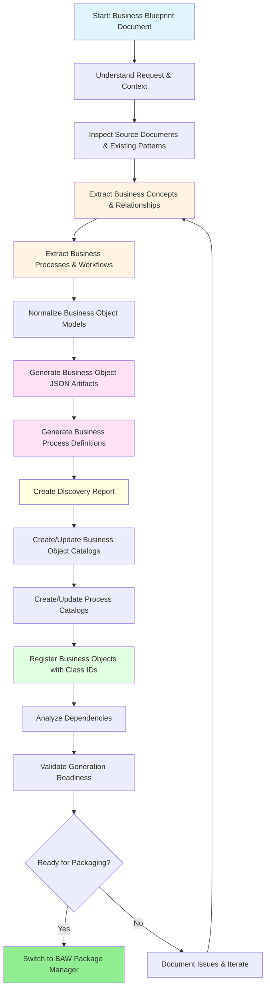
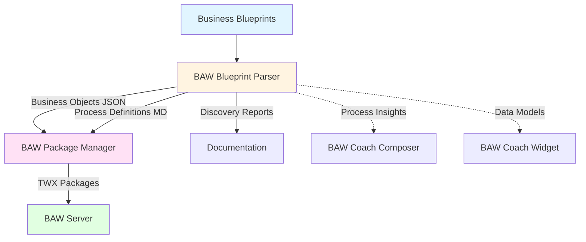

# 📘 BAW Blueprint Parser Mode

## Overview

The **BAW Blueprint Parser** mode is a specialized AI assistant mode designed to transform business documentation into IBM Business Automation Workflow (BAW) artifacts. This mode has evolved from a simple document parser into a comprehensive business modeling system that handles:

- **Business Object Generation** - Data structures and entities
- **Business Process Discovery** - Workflows and process flows
- **Dependency Management** - Relationships and processing order
- **Catalog Management** - Organization by business context
- **Class ID Registration** - Version control and reusability
- **Discovery Documentation** - Traceability and assumptions

## Purpose

This mode serves as the bridge between business documentation and technical implementation by:

### Business Object Capabilities
- **Parsing** business blueprint documents (PDFs, Word docs, etc.) from the `business-blueprints/` directory
- **Extracting** business entities, fields, relationships, and enumerations with industry best practices
- **Normalizing** business concepts into repository-aligned data models
- **Generating** JSON business object files with proper structure and metadata
- **Creating** comprehensive discovery reports documenting assumptions and traceability
- **Managing** catalog artifacts for business object organization by context
- **Registering** business objects with deterministic BAW class IDs for version control
- **Analyzing** dependencies and providing optimal processing order
- **Reusing** existing business object definitions across widgets and processes

### Business Process Capabilities
- **Discovering** business processes and workflows from blueprint documents
- **Modeling** process flows with actors, activities, and decision points
- **Generating** BPMN configuration files (JSON) following the schema in BPMN_tools/CONFIG_SCHEMA_DESIGN.md
- **Generating** Mermaid diagrams for process visualization
- **Documenting** process steps, business rules, and integration points
- **Linking** processes to relevant business objects (data flow)
- **Creating** process catalogs organized by business context
- **Preparing** config-driven BPMN generation with pre-defined element IDs

## When to Use This Mode

Use the BAW Blueprint Parser mode when you need to:

### Business Object Tasks
- ✅ Analyze business documents and extract comprehensive data models
- ✅ Transform business requirements into structured business objects
- ✅ Generate JSON business object definitions from documentation
- ✅ Create discovery reports documenting business entities and relationships
- ✅ Create catalog files for business object organization by context
- ✅ Register business objects with deterministic class IDs
- ✅ Analyze dependencies between business objects
- ✅ Prepare business objects for packaging into BAW toolkits
- ✅ Document assumptions, enumerations, and traceability
- ✅ Reuse existing business object definitions across projects

### Business Process Tasks
- ✅ Discover and model business processes from blueprint documents
- ✅ Generate BPMN configuration files (JSON) with pre-defined IDs for all elements
- ✅ Generate Mermaid diagrams for process visualization
- ✅ Document process workflows with actors and decision points
- ✅ Link processes to business objects (data flow)
- ✅ Create process catalogs organized by context
- ✅ Enable deterministic BPMN XML generation via config-driven approach
- ✅ Identify subprocesses and process relationships
- ✅ Document integration points and system interactions

**Do NOT use this mode for:**

- ❌ Packaging business objects/processes into TWX files (use BAW Package Manager)
- ❌ Deploying toolkits to BAW servers (use BAW Package Manager)
- ❌ Creating or modifying coach widgets (use BAW Coach Widget)
- ❌ Designing coach layouts (use BAW Coach Composer)
- ❌ Generating BPMN XML directly (use BPMN_tools Python scripts with generated configs)

## Workflow



## Detailed Workflow Steps

### 1. Understand the Blueprint Request

**Purpose:** Identify the business domain, source documents, and intended outcome.

**Actions:**
- Determine which files/folders in `business-blueprints/` are in scope
- Identify the business domain or context name for output organization
- Clarify if the user wants analysis only, planning, or actual generation
- Identify naming constraints, namespaces, or catalog preferences

### 2. Inspect Source Documents and Existing Patterns

**Purpose:** Read source documents and understand repository conventions.

**Actions:**
- Inspect selected business blueprint sources
- Read comparable existing business object JSON examples
- Review existing generation utilities and helpers
- Use repository's artifact structure as reference

**Important:** Always ground generation decisions in existing repository conventions rather than inventing new schemas.

### 3. Extract Business Concepts and Relationships

**Purpose:** Identify candidate business objects, fields, relationships, and enumerations.

**Actions:**
- Identify core business entities (e.g., Policy, Claim, Application)
- Extract supporting objects (e.g., Address, Document, Payment)
- Identify enumerations and their valid values
- Extract attributes, types, optionality, and constraints
- Map relationships between entities (1:1, 1:N, N:M)
- Identify nested objects and complex types
- Document business rules and validation constraints
- Capture ambiguous or incomplete sections for review

**Output:** Comprehensive structured understanding of the business domain.

### 4. Extract Business Processes and Workflows

**Purpose:** Identify and model business processes described in the blueprint.

**Actions:**
- Scan for process descriptions, workflows, and sequential activities
- Identify process names, actors, and swimlanes
- Extract process steps, decision points, and flow logic
- Map processes to relevant business objects (data flow)
- Identify subprocesses and process relationships
- Note integration points and system interactions

**Output:** Structured understanding of business processes alongside business objects.

### 5. Normalize Business Object Models

**Purpose:** Transform extracted concepts into stable business object models.

**Actions:**
- Resolve duplicate or overlapping entities
- Normalize naming conventions (PascalCase for objects, camelCase for fields)
- Separate enumerations, nested objects, and references
- Align field typing with BAW type mappings
- Ensure consistency across related objects
- Optimize for reusability across widgets and processes

### 6. Generate Business Object JSON Artifacts

**Purpose:** Create JSON business object files.

**Actions:**
- Generate one JSON file per business object under `business-objects/generated/[context]/`
- Use stable PascalCase file names (e.g., `Claim.json`, `Policy.json`)
- Include complete property definitions with types and descriptions
- Handle complex types and array properties
- Reference other business objects correctly
- Ensure JSON structure matches BAW packaging requirements

### 7. Generate BPMN Process Configurations

**Purpose:** Create JSON configuration files for each identified business process following the config-driven architecture.

**Config-Driven Architecture:**
```
Blueprint Document → GenAI Analysis → JSON Config → Python Generator → BPMN XML
                     (This Mode)                      (BPMN_tools)
```

**GenAI Role (This Mode):**
- Analyze business documents and extract process information
- Understand business context, actors, and workflows
- Create structured JSON configurations with pre-defined IDs
- Handle ambiguity and incomplete information

**Python Role (BPMN_tools):**
- Read JSON configurations
- Generate valid BPMN 2.0 XML
- Ensure proper element references
- Apply BAW-specific conventions

**Actions:**
- Generate one JSON config file per process under `business-processes/configs/[context]/`
- Follow the schema defined in `BPMN_tools/CONFIG_SCHEMA_DESIGN.md`
- Extract process metadata (id, name, description, version)
- Identify and define all roles/actors with unique IDs using `role-[name]` pattern
- Extract milestones with unique IDs using `ms-[name]` pattern
- Identify all BPMN elements (start events, tasks, gateways, end events) with unique IDs using `elem-[type]-[number]` pattern
- Define sequence flows connecting elements with unique IDs using `flow-[number]` pattern
- Create swimlanes for multi-role processes with unique IDs using `lane-[role-id]` pattern
- Link process activities to relevant business objects
- Validate config structure before saving
- Optionally generate companion Mermaid diagram for visualization

**Important:** The config-driven approach separates document understanding (GenAI) from BPMN XML generation (Python), ensuring reliable and maintainable BPMN artifacts.

**Config Structure (JSON):**
- **process**: `{id, name, description, version}` - Process metadata
- **metadata**: `{context, complexity, estimatedDuration}` - Additional metadata
- **roles**: `[{id, name, type, description}]` - All actors (human, system, external)
- **milestones**: `[{id, name, description}]` - Key process phases
- **elements**: `[{id, type, name, assignee, incoming, outgoing}]` - BPMN flow nodes
- **flows**: `[{id, sourceRef, targetRef, name, conditionExpression}]` - Sequence flows
- **lanes**: `[{id, name, flowNodeRefs}]` - Swimlanes (optional)

**ID Naming Conventions:**
- Process IDs: `proc-[context]-[number]` (e.g., `proc-insurance-001`)
- Role IDs: `role-[name]` (e.g., `role-agent`, `role-underwriter`)
- Milestone IDs: `ms-[name]` (e.g., `ms-application-submitted`)
- Element IDs: `elem-[type]-[number]` (e.g., `elem-start-1`, `elem-task-1`, `elem-gateway-1`)
- Flow IDs: `flow-[number]` (e.g., `flow-1`, `flow-2`)
- Lane IDs: `lane-[role-id]` (e.g., `lane-role-agent`)

### 8. Create Discovery Report

**Purpose:** Document the complete business model with traceability.

**Actions:**
- Create comprehensive discovery report at `business-objects/reports/[context].discovery-report.md`
- Document all core entities with full attribute lists
- Document all supporting objects
- List all enumerations with valid values
- Map relationships and dependencies
- Document business rules and constraints
- List assumptions and considerations
- Provide integration points and process workflows

**Output:** Complete documentation for stakeholder review and future reference.

### 9. Create and Update Business Object Catalogs

**Purpose:** Organize business objects by context.

**Actions:**
- Create context catalog at `business-objects/catalog/[context].catalog.json`
- Update global catalog at `business-objects/catalog/master.catalog.json`
- List all business objects in the context
- Document context purpose and scope
- Track creation and modification dates

### 10. Create and Update Process Catalogs

**Purpose:** Organize business processes by context.

**Actions:**
- Create process catalog at `business-processes/catalog/[context].process-catalog.json`
- Update master process catalog at `business-processes/catalog/master.process-catalog.json`
- List all processes with metadata
- Include relationships between processes
- Link processes to business objects they use

### 11. Register Business Objects with Class IDs

**Purpose:** Assign unique BAW class IDs to all business objects for version control.

**Actions:**
- Run the registration process: `python3 register_business_objects.py`
- Verify all objects are registered in `toolkit_packager/baw_custom_types.json`
- Confirm class IDs are deterministic (same name + context = same GUID)
- Track which widgets use each business object
- Note any circular dependencies (normal and expected)

**Important:** Class ID registration is idempotent - running multiple times reuses existing IDs. This ensures stable identifiers for packaging and version control.

**Registry Benefits:**
- Enables business object reuse across widgets
- Maintains version control through deterministic GUIDs
- Tracks usage and dependencies
- Supports incremental development

### 12. Analyze Dependencies

**Purpose:** Understand relationships and processing order.

**Actions:**
- Build dependency graph between business objects
- Identify circular dependencies
- Determine optimal processing order (dependencies first)
- Validate all referenced types exist
- Document dependency relationships
- Verify process-to-business-object links are valid

### 13. Validate Generation Readiness

**Purpose:** Verify artifacts are consistent and follow conventions.

**Actions:**
- Verify object names are unique within context
- Verify all referenced objects are resolvable
- Verify field types match supported BAW type mappings
- Verify all business objects have registered class IDs
- Verify process names are unique and properly structured
- Verify process-to-business-object links are valid
- Check catalog consistency
- Review discovery report completeness
- Review assumptions or unresolved ambiguities

### 14. Preserve Boundaries and Handoff Cleanly

**Purpose:** Complete artifact generation and hand off to packaging mode.

**Actions:**
- Summarize what was generated (business objects and processes) and from which sources
- List all generated business objects by context
- List all generated business processes by context
- State any assumptions that influenced the output model
- Reference the discovery report for detailed documentation
- When packaging/deployment is needed, hand off to `baw-package-manager`

**Handoff Example:**
```xml
<switch_mode>
  <mode_slug>baw-package-manager</mode_slug>
  <reason>Business object JSON artifacts and business process definitions are ready for toolkit packaging. Generated 18 business objects and 4 processes for LifeInsuranceAndAnnuities context.</reason>
</switch_mode>
```

## Output Structure

### Business Objects

```
business-objects/
├── generated/
│   └── [context]/              # e.g., LifeInsuranceAndAnnuities
│       ├── Address.json
│       ├── Policy.json
│       ├── Claim.json
│       └── ...
├── catalog/
│   ├── [context].catalog.json  # Context-specific catalog
│   └── master.catalog.json     # Global catalog
└── reports/
    └── [context].discovery-report.md  # Comprehensive discovery documentation
```

### Business Processes

```
business-processes/
├── configs/
│   └── [context]/              # e.g., LifeInsuranceAndAnnuities
│       ├── NewBusinessApplication.bpmn-config.json  # BPMN config for Python generator
│       ├── ClaimsProcessing.bpmn-config.json
│       ├── PolicyAdministration.bpmn-config.json
│       └── ...
├── diagrams/                   # Optional: Mermaid diagrams for visualization
│   └── [context]/
│       ├── NewBusinessApplication.md
│       ├── ClaimsProcessing.md
│       └── ...
└── catalog/
    ├── [context].process-catalog.json  # Context-specific process catalog
    └── master.process-catalog.json     # Global process catalog
```

### File Naming Conventions

- **Business Objects:** PascalCase (e.g., `Claim.json`, `PolicyHolder.json`)
- **BPMN Configs:** PascalCase with `.bpmn-config.json` suffix (e.g., `NewBusinessApplication.bpmn-config.json`)
- **Process Diagrams:** PascalCase with `.md` extension (e.g., `NewBusinessApplication.md`) - Optional
- **Context:** Derived from business domain (e.g., `LifeInsuranceAndAnnuities`)
- **Catalogs:** `[context].catalog.json` and `master.catalog.json` for objects; `[context].process-catalog.json` and `master.process-catalog.json` for processes
- **Reports:** `[context].discovery-report.md` (comprehensive documentation)

## Core Principles

1. **Authoritative Source:** Treat business blueprints as the authoritative source for both data and process models
2. **Business Meaning First:** Extract business meaning before generating JSON and BPMN config artifacts
3. **Dual Discovery:** Discover both data structures (business objects) and workflows (business processes)
4. **Reuse Conventions:** Use existing repository patterns and utilities
5. **Deterministic Output:** Keep generated artifacts consistent and organized by context
6. **Config-Driven BPMN:** Generate BPMN configs with pre-defined IDs for deterministic XML generation
7. **Packaging-Ready:** Produce outputs ready for packaging without performing packaging
8. **Document Assumptions:** Record assumptions and ambiguities when inferring business meaning
9. **Link Data and Process:** Connect processes to business objects they consume or produce

## Example Usage

### Scenario 1: Parse Life Insurance Blueprint for Business Objects

**User Request:**
> "Parse the LifeInsuranceAndAnnuities-2.pdf blueprint and generate business objects"

**Mode Actions:**
1. Read `business-blueprints/LifeInsuranceAndAnnuities-2.pdf`
2. Extract core entities: Policy, Claim, Beneficiary, Agent, etc.
3. Extract supporting objects: Address, Document, Payment, etc.
4. Identify enumerations: PolicyStatus, ClaimType, PaymentMethod, etc.
5. Normalize field names and types
6. Generate 18 JSON files in `business-objects/generated/LifeInsuranceAndAnnuities/`
7. Create comprehensive discovery report at `business-objects/reports/LifeInsuranceAndAnnuities.discovery-report.md`
8. Create catalog at `business-objects/catalog/LifeInsuranceAndAnnuities.catalog.json`
9. Update master catalog at `business-objects/catalog/master.catalog.json`
10. Register all business objects with deterministic class IDs using `python3 register_business_objects.py`
11. Analyze dependencies and provide processing order
12. Hand off to BAW Package Manager for packaging

### Scenario 2: Parse Life Insurance Blueprint for Business Processes

**User Request:**
> "Extract business processes from the LifeInsuranceAndAnnuities blueprint"

**Mode Actions:**
1. Read `business-blueprints/LifeInsuranceAndAnnuities-2.pdf`
2. Identify key workflows: New Business Application, Claims Processing, Policy Administration, Annuity Payout
3. Extract process steps, actors, and decision points for each workflow
4. For each process, generate BPMN config JSON file following `BPMN_tools/CONFIG_SCHEMA_DESIGN.md` schema:
   - Extract process metadata (id: `proc-insurance-001`, name, description, version)
   - Identify roles (e.g., `role-agent`, `role-underwriter`, `role-system`)
   - Define milestones (e.g., `ms-application-submitted`, `ms-underwriting-complete`)
   - Extract elements (start events, tasks, gateways, end events) with IDs like `elem-start-1`, `elem-task-1`
   - Define sequence flows (e.g., `flow-1`, `flow-2`) connecting elements
   - Create swimlanes (e.g., `lane-role-agent`) for multi-role processes
5. Link processes to relevant business objects (Application, Policy, Claim, etc.)
6. Validate config structure (valid references, proper flow logic)
7. Save BPMN configs to `business-processes/configs/LifeInsuranceAndAnnuities/`
8. Optionally generate companion Mermaid diagrams for visualization
9. Create process catalog at `business-processes/catalog/LifeInsuranceAndAnnuities.process-catalog.json`
10. Update master process catalog
11. Configs are ready for Python BPMN generator in `BPMN_tools/`

### Scenario 3: Complete Blueprint Analysis (Objects + Processes)

**User Request:**
> "Perform complete analysis of the LifeInsuranceAndAnnuities blueprint"

**Mode Actions:**
1. Execute both business object and business process workflows
2. Generate comprehensive discovery report covering:
   - 18 business objects with full specifications
   - 26 enumerations with valid values
   - 4+ business processes with BPMN configs and Mermaid diagrams
   - Business rules and constraints
   - Integration points and system interactions
3. Create cross-references between processes and business objects
4. Register all artifacts with appropriate catalogs
5. Provide complete traceability documentation
6. Hand off to BAW Package Manager when packaging is needed

## Integration with Other Modes



**Workflow Integration:**
- **Input:** Business documentation in `business-blueprints/`
- **This Mode:**
  - Generates structured business objects (JSON)
  - Generates business process definitions (Markdown + Mermaid)
  - Creates discovery reports and catalogs
  - Registers artifacts with class IDs
- **Output Consumers:**
  - **BAW Package Manager:** Packages business objects into TWX files
  - **BAW Coach Composer:** Uses process insights for coach design
  - **BAW Coach Widget:** References business objects for data binding
  - **Documentation:** Discovery reports for stakeholder review

## Best Practices

### ✅ Do

**Business Objects:**
- Read existing business object examples before generating new ones
- Use consistent naming conventions (PascalCase for objects, camelCase for fields)
- Document assumptions in discovery reports when business meaning is unclear
- Validate all references and relationships before completion
- Register business objects with class IDs before packaging
- Analyze dependencies and provide processing order
- Create comprehensive discovery reports with enumerations and constraints

**Business Processes:**
- Extract process workflows alongside business objects
- Generate BPMN config JSON files following CONFIG_SCHEMA_DESIGN.md schema
- Generate pre-defined IDs for all elements to enable deterministic BPMN XML generation
- Generate companion Mermaid diagrams with proper swimlanes for visualization
- Link processes to business objects they consume or produce
- Document decision points and business rules
- Create process catalogs organized by context
- Identify subprocesses and process relationships

**General:**
- Organize artifacts by business context
- Maintain deterministic file naming
- Hand off to BAW Package Manager when packaging is needed
- Preserve traceability from blueprint to generated artifacts

### ❌ Don't

- Don't package or deploy artifacts in this mode
- Don't invent new JSON schemas without checking existing patterns
- Don't modify widget implementations
- Don't create coach layouts
- Don't skip the class ID registration step
- Don't generate BPMN XML directly (generate config files for BPMN_tools to consume)
- Don't create processes without linking to relevant business objects
- Don't forget to generate both BPMN config JSON and Mermaid diagram for each process

## Troubleshooting

### Issue: Ambiguous Business Concepts

**Solution:** Document assumptions in the parse report and clarify with the user before generating JSON.

### Issue: Circular Dependencies

**Solution:** This is normal for complex business models. The registration process handles circular dependencies automatically.

### Issue: Missing Field Types

**Solution:** Review existing business objects for similar fields and use consistent typing conventions.

### Issue: Duplicate Entity Names

**Solution:** Normalize entity names during the model normalization step to ensure uniqueness within the context.

## Related Documentation

- [BAW Package Manager Mode](./BAW_PACKAGE_MANAGER_MODE.md) - For packaging and deployment
- [BAW Coach Widget Mode](./BAW_COACHUI_VIEW_MODE.md) - For widget implementation
- [BAW Coach Composer Mode](./BAW_COACH_COMPOSER_MODE.md) - For coach design

## Summary

The BAW Blueprint Parser mode is your specialized assistant for transforming business documentation into structured, packaging-ready artifacts including:

- **Business Objects** - JSON definitions with deterministic class IDs
- **BPMN Configurations** - JSON config files with pre-defined IDs for deterministic BPMN XML generation
- **Business Processes** - Mermaid diagrams for visualization
- **Discovery Reports** - Comprehensive documentation with traceability
- **Catalogs** - Organized by business context for easy navigation
- **Dependency Analysis** - Processing order and relationship mapping

It handles the complex task of extracting business meaning from documents and generating consistent, well-organized artifacts that integrate seamlessly with the BAW toolkit packaging workflow.

**Key Takeaway:** This mode focuses on document-to-model transformation (both data and process) and stops at the packaging boundary, ensuring clean separation of concerns and smooth handoffs to other specialized modes.

## Evolution Highlights

### Phase 1: Basic Business Object Generation
- Simple JSON generation from blueprints
- Manual catalog management
- Basic field extraction

### Phase 2: Enhanced Business Object Management (Current)
- Comprehensive discovery reports with enumerations
- Deterministic class ID registration
- Dependency analysis and processing order
- Reusable business objects across widgets
- Context-based organization
- Master and context-specific catalogs

### Phase 3: Business Process Discovery (Current)
- Process workflow extraction from blueprints
- Mermaid diagram generation
- Actor and swimlane modeling
- Process-to-business-object linking
- Process catalogs and metadata
- Structured preparation for future BPMN generation

### Phase 4: Config-Driven BPMN Generation (Current)
- BPMN configuration file generation (JSON)
- Pre-defined element IDs for deterministic generation
- Schema-based validation (CONFIG_SCHEMA_DESIGN.md)
- Python-based BPMN XML generation from configs
- Separation of concerns: GenAI creates config, Python generates XML

### Phase 5: BAW Process Packaging (Planned)
- BAW process artifact packaging
- Deployment-ready process definitions
- Integration with BAW Package Manager