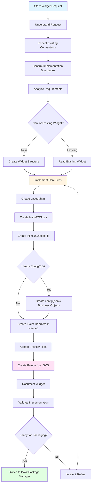
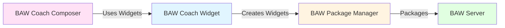

# 📲 BAW Coach Widget Mode

## Overview

The **BAW Coach Widget** mode (also known as BAW CoachUI View mode) is a specialized AI assistant mode designed for creating and modifying IBM Business Automation Workflow (BAW) custom coach view widgets. This mode excels at widget folder structure, accessible HTML layouts, scoped CSS, BAW inline JavaScript patterns, widget configuration metadata, business object definitions, preview implementations, and widget-focused documentation.

## Purpose

This mode serves as your widget implementation specialist by:

- **Creating** new BAW custom coach view widgets from scratch
- **Modifying** existing widget implementations
- **Designing** accessible HTML layouts with semantic structure
- **Styling** widgets with scoped CSS following BAW conventions
- **Implementing** BAW inline JavaScript patterns for data binding and events
- **Configuring** widget metadata and business object definitions
- **Building** preview implementations for standalone testing
- **Documenting** widget behavior, data models, and event handlers
- **Generating** palette icons for widget catalog display

## When to Use This Mode

Use the BAW Coach Widget mode when you need to:

- ✅ Create a new BAW custom widget
- ✅ Modify an existing widget's layout, styling, or behavior
- ✅ Add or update widget preview files for standalone testing
- ✅ Define widget configuration metadata (config.json)
- ✅ Create business object definitions for widget data binding
- ✅ Document widget data models and event handlers
- ✅ Add event handlers for BAW lifecycle events
- ✅ Create widget palette icons (SVG)

**Do NOT use this mode for:**

- ❌ Packaging widgets into TWX files (use BAW Package Manager)
- ❌ Deploying widgets to BAW servers (use BAW Package Manager)
- ❌ Designing coach layouts (use BAW Coach Composer)
- ❌ Parsing business blueprints (use BAW Blueprint Parser)

## Workflow



## Detailed Workflow Steps

### 1. Understand the Widget Request

**Purpose:** Identify whether creating new widget, updating existing, or adding features.

**Actions:**
- Determine if this is a new widget or modification
- Identify widget name and purpose
- Understand required functionality and data binding
- Note any specific design or behavior requirements

### 2. Inspect Existing Project Conventions

**Purpose:** Review nearby widgets to understand repository patterns.

**Actions:**
- Review similar widgets for structural patterns
- Check simple display widgets for basic patterns
- Check list-based widgets for iteration patterns
- Check widgets with business objects for complex data binding
- Identify common naming and organization conventions

**Example:**
```xml
<read_file>
  <args>
    <file>
      <path>widgets/ProgressBar/widget/config.json</path>
    </file>
    <file>
      <path>widgets/ProgressBar/widget/Layout.html</path>
    </file>
    <file>
      <path>widgets/ProgressBar/widget/inlineJavascript.js</path>
    </file>
  </args>
</read_file>
```

### 3. Confirm Implementation Boundaries

**Purpose:** Stay within widget creation scope.

**Actions:**
- Focus on widget implementation only
- Avoid TWX generation or packaging
- Avoid deployment or server operations
- Hand off to BAW Package Manager when packaging is needed

### Phase: Analysis

**Description:** Analyze requirements and project patterns before editing.

**Steps:**
1. Identify the widget name and target folder under `widgets/`
2. Check if similar widgets exist for reference
3. Determine required and optional files for the requested behavior

### Phase: Implementation

**Description:** Implement or update the widget files.

#### Create Layout.html

**Purpose:** Define semantic HTML structure with accessibility.

**Key Elements:**
- Use semantic HTML5 elements
- Include ARIA attributes for accessibility
- Use BAW data binding syntax: `${this.context.binding.propertyName}`
- Structure content logically

**Example:**
```html
<div class="progress-bar-container" role="progressbar" 
     aria-valuenow="${this.context.binding.percentage}" 
     aria-valuemin="0" 
     aria-valuemax="100">
  <div class="progress-bar-label">${this.context.binding.label}</div>
  <div class="progress-bar-track">
    <div class="progress-bar-fill" style="width: ${this.context.binding.percentage}%"></div>
  </div>
  <div class="progress-bar-text">${this.context.binding.percentage}%</div>
</div>
```

#### Create InlineCSS.css

**Purpose:** Style the widget with scoped CSS.

**Key Principles:**
- Scope all styles to widget container
- Use BEM or similar naming convention
- Support theming and customization
- Ensure responsive design

**Example:**
```css
.progress-bar-container {
  width: 100%;
  padding: 10px;
  font-family: var(--font-family, Arial, sans-serif);
}

.progress-bar-track {
  width: 100%;
  height: 20px;
  background-color: #e0e0e0;
  border-radius: 10px;
  overflow: hidden;
}

.progress-bar-fill {
  height: 100%;
  background-color: #4CAF50;
  transition: width 0.3s ease;
}
```

#### Create inlineJavascript.js

**Purpose:** Implement BAW data binding and widget behavior.

**Key Patterns:**
- Access data via `this.context.binding`
- Access options via `this.context.options`
- Use BAW event system for interactions
- Handle data changes and updates

**Example:**
```javascript
// Access widget data
var percentage = this.context.binding.get("value.percentage");
var label = this.context.binding.get("value.label");

// Access widget options
var showLabel = this.context.options.get("showLabel");
var color = this.context.options.get("color");

// Update widget display
if (showLabel) {
  this.context.element.find(".progress-bar-label").text(label);
}

// Listen for data changes
this.context.binding.get("value").addPropertyChangeListener(function(event) {
  // Update display when data changes
  var newPercentage = event.newValue.percentage;
  this.context.element.find(".progress-bar-fill").css("width", newPercentage + "%");
}.bind(this));
```

#### Create config.json (When Needed)

**Purpose:** Define widget metadata and configuration options.

**Structure:**
```json
{
  "name": "ProgressBar",
  "displayName": "Progress Bar",
  "description": "Displays progress as a visual bar",
  "version": "1.0.0",
  "category": "Visualization",
  "binding": {
    "type": "ProgressData",
    "required": true
  },
  "options": [
    {
      "name": "showLabel",
      "type": "Boolean",
      "default": true,
      "description": "Show progress label"
    },
    {
      "name": "color",
      "type": "String",
      "default": "#4CAF50",
      "description": "Progress bar color"
    }
  ]
}
```

#### Create Business Object Definitions (When Needed)

**Purpose:** Define complex data structures for widget binding.

**Example:** `ProgressData.json`
```json
{
  "type": "ProgressData",
  "properties": {
    "percentage": {
      "type": "Integer",
      "description": "Current progress percentage (0-100)"
    },
    "label": {
      "type": "String",
      "description": "Progress label text"
    },
    "currentStep": {
      "type": "Integer",
      "description": "Current step number"
    },
    "totalSteps": {
      "type": "Integer",
      "description": "Total number of steps"
    }
  }
}
```

#### Create Event Handlers (Only When Needed)

**Purpose:** Handle BAW lifecycle events for specific widget functionality.

**Important:** Not all widgets need event handlers. Create only what's necessary for the widget's functionality.

**Available Events:**
- `load.js` - Widget initialization
- `change.js` - Data change handling
- `view.js` - View mode behavior
- `validate.js` - Input validation
- `unload.js` - Cleanup on widget removal

**Example:** `events/change.js`
```javascript
// Handle data changes
var newValue = this.context.binding.get("value");
console.log("Progress updated:", newValue.percentage);

// Trigger custom event
this.context.trigger("progressChanged", {
  percentage: newValue.percentage,
  step: newValue.currentStep
});
```

#### Create Preview Files

**Purpose:** Enable standalone testing outside BAW runtime.

**Files:**
- `AdvancePreview/{WidgetName}.html` - Preview HTML page
- `AdvancePreview/{WidgetName}Snippet.js` - Preview JavaScript

**Example:** `AdvancePreview/ProgressBar.html`
```html
<!DOCTYPE html>
<html>
<head>
  <title>Progress Bar Preview</title>
  <link rel="stylesheet" href="../widget/InlineCSS.css">
</head>
<body>
  <div id="widget-container"></div>
  <script src="ProgressBarSnippet.js"></script>
</body>
</html>
```

#### Create Palette Icon SVG

**Purpose:** Provide visual representation in BAW widget catalog.

**Specifications:**
- Size: 120x120px square
- Format: SVG
- Location: `widgets/{WidgetName}/{WidgetName}.svg`
- Style: Simple, clear, recognizable

**Example:** `ProgressBar.svg`
```xml
<svg width="120" height="120" xmlns="http://www.w3.org/2000/svg">
  <rect x="10" y="50" width="100" height="20" fill="#e0e0e0" rx="10"/>
  <rect x="10" y="50" width="60" height="20" fill="#4CAF50" rx="10"/>
</svg>
```

### Phase: Validation

**Description:** Verify the widget implementation is coherent.

**Steps:**
1. Check naming consistency across all files
2. Ensure documentation matches actual implementation
3. Verify data binding patterns are correct
4. Confirm event handlers are properly structured
5. Test preview files work standalone
6. Verify palette icon displays correctly
7. Confirm mode stays at packaging boundary

### Completion & Handoff

**Purpose:** Complete widget implementation and hand off to packaging.

**Actions:**
- Summarize what was created or modified
- Confirm all required files are in place
- Automatically switch to BAW Package Manager mode for packaging

**Switch Template:**
```xml
<switch_mode>
  <mode_slug>baw-package-manager</mode_slug>
  <reason>Widget implementation complete. Ready to package and deploy.</reason>
</switch_mode>
```

## Widget Folder Structure

```
widgets/
└── {WidgetName}/
    ├── {WidgetName}.svg              # Palette icon (120x120px)
    ├── README.md                      # Widget documentation
    ├── widget/
    │   ├── Layout.html                # HTML structure
    │   ├── InlineCSS.css              # Scoped styles
    │   ├── inlineJavascript.js        # BAW JavaScript
    │   ├── config.json                # Widget metadata (optional)
    │   ├── datamodel.md               # Data model docs (optional)
    │   ├── eventHandler.md            # Event handler docs (optional)
    │   └── events/                    # Event handlers (optional)
    │       ├── load.js
    │       ├── change.js
    │       ├── view.js
    │       ├── validate.js
    │       └── unload.js
    └── AdvancePreview/                # Preview files (optional)
        ├── {WidgetName}.html
        └── {WidgetName}Snippet.js
```

## Core Principles

1. **Semantic Structure:** Use accessible HTML with proper ARIA attributes
2. **Scoped Styling:** Keep CSS scoped to widget container
3. **BAW Patterns:** Follow BAW data binding and event conventions
4. **Repository Conventions:** Match existing widget patterns
5. **Complete Documentation:** Document data models and event handlers
6. **Preview Support:** Enable standalone testing when possible
7. **Visual Identity:** Provide clear palette icons
8. **Packaging Boundary:** Stop at widget implementation, hand off packaging

## Example Usage

### Scenario: Create a Stepper Widget

**User Request:**
> "Create a stepper widget that shows multi-step progress with clickable steps"

**Mode Actions:**

1. **Analyze Requirements:**
   - Display multiple steps with labels
   - Show current step, completed steps, pending steps
   - Allow clicking on completed steps to navigate
   - Support custom styling

2. **Create Widget Structure:**
   ```
   widgets/Stepper/
   ├── Stepper.svg
   ├── README.md
   └── widget/
       ├── Layout.html
       ├── InlineCSS.css
       ├── inlineJavascript.js
       ├── config.json
       ├── datamodel.md
       ├── eventHandler.md
       └── events/
           └── change.js
   ```

3. **Implement Layout.html:**
   ```html
   <div class="stepper-container">
     <div class="stepper-steps">
       <!-- Steps rendered dynamically -->
     </div>
   </div>
   ```

4. **Implement InlineCSS.css:**
   ```css
   .stepper-container {
     display: flex;
     align-items: center;
     padding: 20px;
   }
   
   .stepper-step {
     display: flex;
     align-items: center;
     flex: 1;
   }
   
   .stepper-step.completed .stepper-circle {
     background-color: #4CAF50;
   }
   ```

5. **Implement inlineJavascript.js:**
   ```javascript
   var steps = this.context.binding.get("value.steps");
   var currentStep = this.context.binding.get("value.currentStep");
   
   // Render steps dynamically
   steps.forEach(function(step, index) {
     var stepElement = createStepElement(step, index, currentStep);
     this.context.element.find(".stepper-steps").append(stepElement);
   }.bind(this));
   ```

6. **Create config.json:**
   - Define StepperData business object
   - Configure options for styling

7. **Create Preview Files:**
   - Standalone HTML preview
   - Sample data for testing

8. **Create Palette Icon:**
   - 120x120px SVG showing step circles

9. **Document Widget:**
   - README with usage examples
   - Data model documentation
   - Event handler documentation

10. **Switch to Package Manager:**
    - Hand off for packaging and deployment

## BAW Data Binding Patterns

### Accessing Data

```javascript
// Get simple value
var value = this.context.binding.get("value");

// Get nested property
var percentage = this.context.binding.get("value.percentage");

// Get array item
var firstStep = this.context.binding.get("value.steps[0]");
```

### Updating Data

```javascript
// Set simple value
this.context.binding.set("value", newValue);

// Set nested property
this.context.binding.set("value.percentage", 75);

// Update array
var steps = this.context.binding.get("value.steps");
steps.push(newStep);
this.context.binding.set("value.steps", steps);
```

### Listening for Changes

```javascript
// Listen to property changes
this.context.binding.get("value").addPropertyChangeListener(function(event) {
  console.log("Old value:", event.oldValue);
  console.log("New value:", event.newValue);
  // Update UI
}.bind(this));
```

### Accessing Options

```javascript
// Get configuration option
var showLabel = this.context.options.get("showLabel");
var color = this.context.options.get("color");
```

## Integration with Other Modes



**Workflow Integration:**
- **This Mode:** Creates and modifies widget implementations
- **After:** Automatically hands off to BAW Package Manager for packaging
- **Used By:** BAW Coach Composer for coach design

## Best Practices

### ✅ Do

- Use semantic HTML with proper ARIA attributes
- Scope all CSS to widget container
- Follow BAW data binding patterns
- Create preview files for standalone testing
- Document data models and event handlers
- Create clear, recognizable palette icons (120x120px SVG)
- Review similar widgets before implementing
- Hand off to BAW Package Manager after completion
- Create event handlers only when needed for widget functionality

### ❌ Don't

- Don't package or deploy widgets in this mode
- Don't use global CSS selectors
- Don't modify other widgets without explicit request
- Don't create coach layouts (use BAW Coach Composer)
- Don't skip accessibility attributes
- Don't forget to create palette icons
- Don't create unnecessary event handlers - only add what the widget needs

## Troubleshooting

### Issue: Data Binding Not Working

**Solution:** Verify the binding path matches the business object structure and use `this.context.binding.get()` correctly.

### Issue: Styles Affecting Other Widgets

**Solution:** Ensure all CSS selectors are scoped to the widget container class.

### Issue: Preview Not Working

**Solution:** Check that preview files correctly reference widget CSS and JavaScript files.

### Issue: Widget Not Appearing in Catalog

**Solution:** Verify that the palette icon SVG exists and is 120x120px square.

## Related Documentation

- [BAW Coach Composer Mode](./BAW_COACH_COMPOSER_MODE.md) - For coach design
- [BAW Package Manager Mode](./BAW_PACKAGE_MANAGER_MODE.md) - For packaging and deployment
- [BAW Blueprint Parser Mode](./BAW_BLUEPRINT_PARSER_MODE.md) - For business object generation

## Summary

The BAW Coach Widget mode is your specialized assistant for creating and modifying BAW custom coach view widgets. It handles the complete widget implementation lifecycle from HTML structure to JavaScript behavior, ensuring widgets follow BAW conventions, are accessible, maintainable, and ready for packaging and deployment.

**Key Takeaway:** This mode focuses exclusively on widget implementation and stops at the packaging boundary, ensuring clean separation of concerns and seamless handoffs to the packaging workflow.