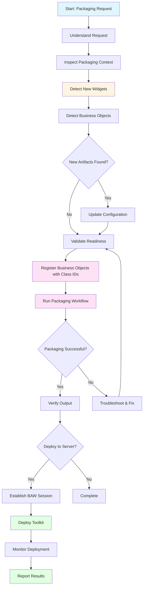
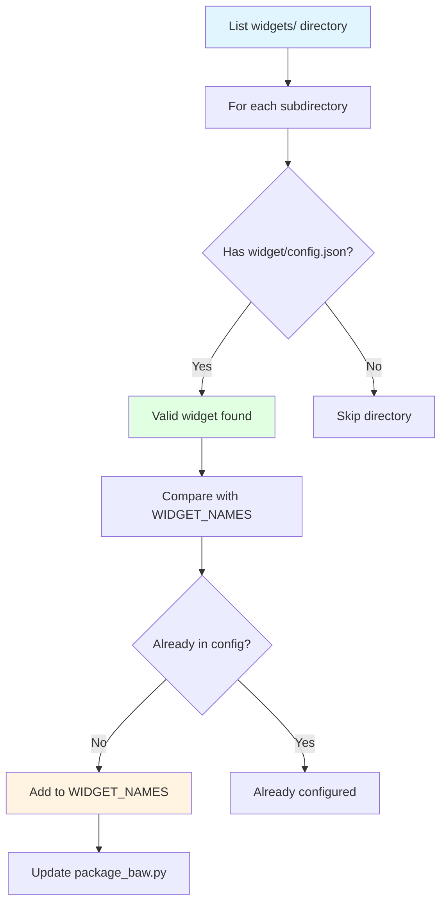
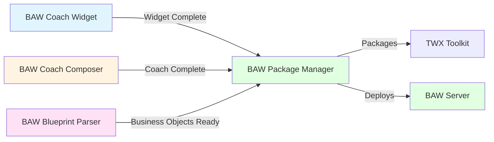

# 🗂️ BAW Package Manager Mode

## Overview

The **BAW Package Manager** mode is a specialized AI assistant mode designed for packaging IBM Business Automation Workflow (BAW) artifacts into TWX toolkit files and deploying them to BAW servers. This mode excels at automatically detecting new widgets and business objects, validating packaging readiness, running the toolkit packaging workflow, and coordinating deployment through MCP tools.

## Purpose

This mode serves as your packaging and deployment specialist by:

- **Automatically detecting** new widgets from the `widgets/` directory
- **Automatically including** standalone business objects from `business-objects/generated/`
- **Automatically including** coaches from the `coaches/` directory
- **Validating** widget structure and packaging readiness
- **Registering** business objects with unique BAW class IDs
- **Updating** packaging configuration with new artifacts
- **Running** the TWX packaging workflow (`package_baw.py`)
- **Verifying** generated toolkit outputs
- **Deploying** toolkits to BAW servers through MCP tools
- **Monitoring** deployment status and reporting results

## When to Use This Mode

Use the BAW Package Manager mode when you need to:

- ✅ Package BAW artifacts (widgets, business objects, coaches) into a toolkit
- ✅ Deploy toolkits to BAW servers
- ✅ Validate packaging readiness
- ✅ Troubleshoot packaging failures
- ✅ Automatically detect and include new widgets
- ✅ Register business objects with class IDs
- ✅ Update packaging configuration

**Do NOT use this mode for:**

- ❌ Creating or modifying widget implementations (use BAW Coach Widget)
- ❌ Designing coach layouts (use BAW Coach Composer)
- ❌ Parsing business blueprints (use BAW Blueprint Parser)
- ❌ Making implementation changes to artifacts

## Workflow



## Detailed Workflow Steps

### 1. Understand the Packaging Request

**Purpose:** Determine what the user wants to accomplish.

**Actions:**
- Identify if validating widgets, packaging artifacts, or deploying
- Understand scope (specific widgets or all artifacts)
- Note any troubleshooting context
- Clarify deployment requirements

### 2. Inspect the Packaging Context

**Purpose:** Review available artifacts and configuration.

**Actions:**
- Review available widgets in `widgets/` directory
- Check packaging scripts and configuration
- Review `toolkit.config.json` for toolkit metadata and BAW version
- Verify BAW template version is configured correctly
- Check existing output expectations

### 3. Detect New Widgets Automatically

**Purpose:** Identify widgets not yet in packaging configuration.

**Actions:**
- List all directories in `widgets/` folder
- For each directory, check for `widget/config.json` file
- Compare valid widgets with `WIDGET_NAMES` in `package_baw.py`
- Identify any missing widgets
- Add new widgets to configuration in alphabetical order

**Example Detection:**
```
Found widgets: Breadcrumb, DateOutput, FileNetBrowser, MultiSelect, ProgressBar, Stepper
Current config: Breadcrumb, DateOutput, MultiSelect, ProgressBar
New widgets detected: FileNetBrowser, Stepper
```

### 4. Detect Business Objects Automatically

**Purpose:** Identify standalone business objects for inclusion.

**Actions:**
- Scan `business-objects/generated/` directory
- TWXBuilder automatically detects all JSON files
- Business objects are processed in dependency order
- No configuration changes needed - detection is automatic

**Important:** Business objects are automatically included by TWXBuilder without requiring configuration updates.

### 5. Update Configuration (If Needed)

**Purpose:** Add newly detected widgets to packaging configuration.

**Actions:**
- If new widgets detected, update `package_baw.py` `WIDGET_NAMES` list
- Add widgets in alphabetical order for consistency
- Confirm update was successful
- Note: Business objects require no configuration changes

**Example Update:**
```python
WIDGET_NAMES = [
    "Breadcrumb",
    "DateOutput",
    "FileNetBrowser",  # ← New widget added
    "MultiSelect",
    "ProgressBar",
    "Stepper"  # ← New widget added
]
```

### 6. Validate Packaging Readiness

**Purpose:** Ensure all artifacts are structurally ready.

**Actions:**
- Validate widget folder structure
- Check for required files (Layout.html, InlineCSS.css, inlineJavascript.js)
- Validate business object JSON structure
- Check for palette icons (SVG files)
- Verify coach XML files are well-formed

### 7. Register Business Objects with Class IDs

**Purpose:** Assign unique BAW class IDs to all business objects.

**Actions:**
- Check if `business-objects/generated/` contains business objects
- Run registration process: `python3 register_business_objects.py`
- Verify all objects registered in `toolkit_packager/baw_custom_types.json`
- Confirm class IDs are stable and deterministic
- Note: Circular dependency warnings are normal

**Important:** This step ensures all business objects have unique BAW class IDs before packaging. Registration is idempotent - running multiple times reuses existing class IDs.

**Example Output:**
```
Registering business objects...
✓ Address (LifeInsuranceAndAnnuities) - Class ID: a1b2c3d4-...
✓ Policy (LifeInsuranceAndAnnuities) - Class ID: e5f6g7h8-...
✓ Claim (LifeInsuranceAndAnnuities) - Class ID: i9j0k1l2-...
⚠ Circular dependencies detected (normal for complex models)
Registration complete: 18 business objects
```

### 8. Run Packaging Workflow

**Purpose:** Execute the TWX packaging process.

**Actions:**
- Execute `package_baw.py` to generate TWX artifact
- BAW template version is read from `toolkit.config.json` (`bawVersion` field)
- Packager automatically includes:
  - Custom widgets from `widgets/`
  - Standalone business objects from `business-objects/generated/`
  - Coaches from `coaches/`
- Capture output path and artifact summary
- Verify package was created successfully

**Command:**
```bash
python3 package_baw.py
```

**Note:** The BAW template version (24.0.1 or 25.0.1) is configured in `toolkit.config.json` under the `bawVersion` field. No command-line arguments are needed.

**Example Output:**
```
Building BAW Toolkit...
✓ Detected 6 widgets
✓ Detected 18 business objects
✓ Detected 3 coaches
✓ Packaging widgets...
✓ Packaging business objects...
✓ Packaging coaches...
✓ Generating TWX file...
✓ Package created: output/MyToolkit_v1.0.0.twx (2.4 MB)
```

### 9. Verify Output

**Purpose:** Confirm successful packaging.

**Actions:**
- Check that TWX file was created
- Verify file size is reasonable
- Confirm all artifact types are included
- Review packaging log for warnings or errors

### 10. Offer Deployment to BAW Server

**Purpose:** Provide seamless transition to deployment.

**Actions:**
- After successful packaging, ask if user wants to deploy
- Provide deployment as suggested follow-up action
- If user confirms, proceed to deployment phase

**Example Prompt:**
> "Packaging successful! Would you like to deploy the toolkit to the BAW server now?"

### 11. Deploy to BAW Server (If Requested)

**Purpose:** Deploy toolkit to BAW server using MCP tools.

**Actions:**
1. **Establish BAW Session:**
   - Use `login` MCP tool to authenticate
   - Provide server URL, username, password
   - Verify successful login

2. **Deploy Toolkit:**
   - Use `install_container` MCP tool
   - Provide TWX file path
   - Specify target process app or toolkit

3. **Monitor Deployment:**
   - Use `get_queue_status` MCP tool
   - Track deployment progress
   - Wait for completion

4. **Report Results:**
   - Confirm successful deployment
   - Report any errors or warnings
   - Provide next steps

**Example Deployment Flow:**
```
1. Logging into BAW server...
   ✓ Connected to https://baw-server.example.com
   
2. Deploying toolkit...
   ✓ Uploading MyToolkit_v1.0.0.twx
   ✓ Installation queued (Job ID: 12345)
   
3. Monitoring deployment...
   ⏳ Processing... (30%)
   ⏳ Processing... (60%)
   ⏳ Processing... (90%)
   ✓ Deployment complete!
   
4. Toolkit deployed successfully
   - 6 widgets installed
   - 18 business objects registered
   - 3 coaches available
```

## Automatic Artifact Detection

### Widget Detection Algorithm



### Business Object Detection

**Automatic Detection by TWXBuilder:**
- TWXBuilder scans `business-objects/generated/` for all JSON files
- Business objects are processed in dependency order
- No configuration changes needed
- Detection is fully automatic
- Packaging log shows all detected business objects

## Packaging Output Structure

### Generated Files

```
output/
└── MyToolkit_v1.0.0.twx          # Main toolkit file
    ├── widgets/                   # Custom widgets
    │   ├── Breadcrumb/
    │   ├── ProgressBar/
    │   └── Stepper/
    ├── business-objects/          # Business objects
    │   ├── Address.json
    │   ├── Policy.json
    │   └── Claim.json
    └── coaches/                   # Coaches
        ├── insurance_application.xml
        └── claim_submission.xml
```

### Toolkit Metadata

From `toolkit.config.json`:
```json
{
  "toolkit": {
    "name": "MyToolkit",
    "shortName": "MT",
    "version": "1.0.0",
    "bawVersion": "25.0.1",
    "description": "Custom BAW widgets and business objects",
    "id": "2066.xxx-xxx-xxx",
    "isToolkit": true
  },
  "dependencies": {
    "systemData": {
      "snapshotId": "2064.xxx",
      "name": "8.6.0.0_TC"
    },
    "uiToolkit": {
      "snapshotId": "2064.xxx",
      "name": "8.6.0.0"
    }
  },
  "output": {
    "directory": "output",
    "filename": "MyToolkit_{version}.twx"
  }
}
```

**Key Configuration Fields:**
- `bawVersion`: BAW template version (24.0.1 or 25.0.1) - determines which template structure to use
- `version`: Toolkit version (auto-incremented during packaging)
- `id`: Persistent toolkit ID for upgrade compatibility
- `shortName`: Toolkit acronym used in BAW

## Core Principles

1. **Automatic Detection:** Automatically find and include new artifacts
2. **No Manual Configuration:** Minimize manual configuration updates
3. **Validation First:** Validate before packaging
4. **Class ID Registration:** Ensure business objects have stable identifiers
5. **Complete Packaging:** Include all artifact types (widgets, BOs, coaches)
6. **Seamless Deployment:** Offer deployment after successful packaging
7. **Clear Reporting:** Provide detailed status and results
8. **Boundary Respect:** Don't modify implementations, only package them

## Example Usage

### Scenario: Package New Widgets and Business Objects

**User Request:**
> "Package the toolkit with all widgets and business objects"

**Mode Actions:**

1. **Detect Artifacts:**
   ```
   Scanning widgets directory...
   ✓ Found 6 widgets (2 new: FileNetBrowser, Stepper)
   
   Scanning business objects...
   ✓ Found 18 business objects in LifeInsuranceAndAnnuities context
   
   Scanning coaches...
   ✓ Found 3 coaches
   ```

2. **Update Configuration:**
   ```
   Updating package_baw.py...
   ✓ Added FileNetBrowser to WIDGET_NAMES
   ✓ Added Stepper to WIDGET_NAMES
   Note: Business objects auto-detected, no config needed
   ```

3. **Register Business Objects:**
   ```
   Running: python3 register_business_objects.py
   ✓ Registered 18 business objects with class IDs
   ✓ All objects in baw_custom_types.json
   ```

4. **Package Toolkit:**
   ```
   Running: python3 package_baw.py
   ✓ Packaging 6 widgets
   ✓ Packaging 18 business objects
   ✓ Packaging 3 coaches
   ✓ Generated: output/MyToolkit_v1.0.0.twx (2.4 MB)
   ```

5. **Offer Deployment:**
   ```
   Packaging successful! Would you like to deploy to BAW server?
   ```

6. **Deploy (If Confirmed):**
   ```
   ✓ Logged into BAW server
   ✓ Deploying toolkit...
   ✓ Deployment complete!
   ```

## Integration with Other Modes



**Workflow Integration:**
- **Receives From:** All other modes hand off to this mode for packaging
- **This Mode:** Packages and deploys all artifacts
- **Deploys To:** BAW servers via MCP tools

## BAW Version Configuration

### Overview

The BAW Package Manager uses a **config-based approach** for template versioning. The BAW template version is specified in `toolkit.config.json` and automatically used during packaging.

### Configuration

In `toolkit.config.json`, set the `bawVersion` field:

```json
{
  "toolkit": {
    "name": "Custom Widgets",
    "shortName": "CW",
    "version": "1.0.96",
    "bawVersion": "25.0.1",  // ← BAW template version
    "id": "2066.xxx-xxx-xxx"
  }
}
```

### Supported Versions

- **24.0.1** - BAW 24.x template (includes 3 dependency toolkits)
- **25.0.1** - BAW 25.x template (includes 2 dependency toolkits) - **Default**

### How It Works

1. **Configuration Loading**: `package_baw.py` reads `bawVersion` from config
2. **Template Selection**: TWXBuilder uses `templates/BaseTWX/{bawVersion}/`
3. **Automatic Dependencies**: Correct toolkit dependencies are included automatically
4. **No Manual Selection**: No command-line arguments or prompts needed

### Switching Versions

To switch BAW versions, simply update the config:

```json
"bawVersion": "24.0.1"  // Change from 25.0.1 to 24.0.1
```

Then run packaging as normal:
```bash
python3 package_baw.py
```

### Benefits

✅ **Single Source of Truth** - Version controlled with your code
✅ **Team Consistency** - Everyone uses the same BAW version
✅ **Automatic Dependencies** - Correct toolkits included automatically
✅ **No Manual Steps** - No prompts or command-line arguments
✅ **Version Tracking** - BAW version tracked in git with your code

## Best Practices

### ✅ Do

- Automatically detect new widgets before packaging
- Register business objects with class IDs before packaging
- Validate all artifacts before running packaging workflow
- Offer deployment after successful packaging
- Provide detailed status and progress updates
- Verify `bawVersion` in config matches target BAW server version
- Use MCP tools for BAW server operations
- Establish login session before deployment
- Monitor deployment status until completion

### ❌ Don't

- Don't modify widget implementations in this mode
- Don't create or modify coaches in this mode
- Don't parse business blueprints in this mode
- Don't skip business object registration
- Don't deploy without successful packaging
- Don't perform BAW operations without login session
- Don't manually edit template version in code - use config instead

## Troubleshooting

### Issue: Widget Not Detected

**Solution:** Verify the widget has a `widget/config.json` file and the folder structure is correct.

### Issue: Business Object Registration Failed

**Solution:** Check that business object JSON files are valid and properly structured. Review error messages for specific issues.

### Issue: Packaging Failed

**Solution:** Review the packaging log for specific errors. Common issues include missing files, invalid JSON, or circular dependencies.

### Issue: Deployment Failed

**Solution:** Verify BAW server credentials, network connectivity, and that the TWX file is valid. Check server logs for detailed error messages.

### Issue: Circular Dependencies Warning

**Solution:** This is normal for complex business models. The registration process handles circular dependencies automatically.

## MCP Tools Reference

### login
**Purpose:** Authenticate with BAW server

**Parameters:**
- `server_url`: BAW server URL
- `username`: User credentials
- `password`: User credentials

### install_container
**Purpose:** Deploy toolkit to BAW server

**Parameters:**
- `twx_file`: Path to TWX file
- `target`: Target process app or toolkit

### get_queue_status
**Purpose:** Monitor deployment progress

**Parameters:**
- `job_id`: Deployment job identifier

## Related Documentation

- [BAW Coach Widget Mode](./BAW_COACHUI_VIEW_MODE.md) - For widget implementation
- [BAW Coach Composer Mode](./BAW_COACH_COMPOSER_MODE.md) - For coach design
- [BAW Blueprint Parser Mode](./BAW_BLUEPRINT_PARSER_MODE.md) - For business object generation

## Summary

The BAW Package Manager mode is your specialized assistant for packaging and deploying BAW artifacts. It automatically detects new widgets and business objects, validates packaging readiness, runs the packaging workflow, and coordinates deployment to BAW servers through MCP tools. This mode ensures a seamless transition from development to deployment with minimal manual configuration.

**Key Takeaway:** This mode focuses on packaging and deployment workflows for all BAW artifacts, automatically detecting and including new widgets and business objects, and providing seamless deployment to BAW servers after successful packaging.