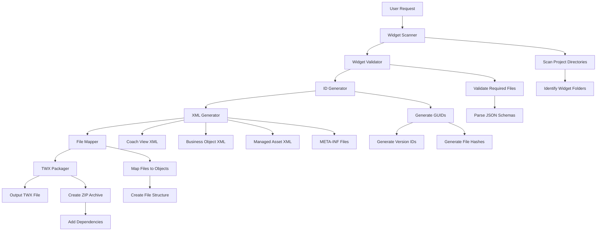
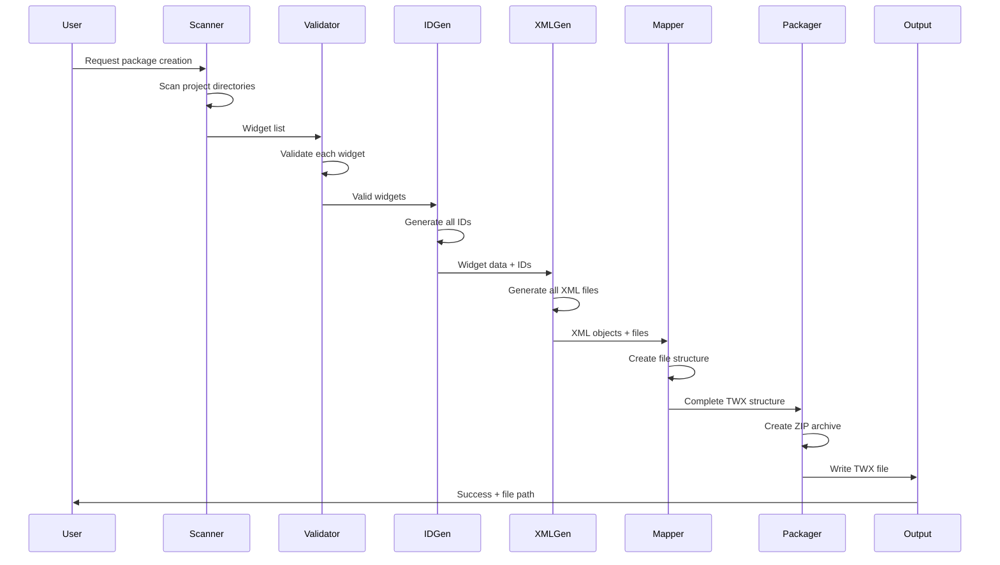

# BAW Package Manager Mode - Implementation Plan

## Executive Summary

The `baw-package-manager` mode will automate the creation of IBM BAW Toolkit (TWX) files from widget source code, eliminating manual copy-paste workflows and enabling rapid deployment of custom widgets to BAW servers.

## Project Goals

1. **Automate TWX Generation**: Convert widget directories into deployable TWX files
2. **Multi-Widget Support**: Package all project widgets into a single toolkit
3. **Maintain Compatibility**: Generate TWX files compatible with BAW 25.0.1+
4. **Ensure Consistency**: Use deterministic ID generation for reproducible builds
5. **Simplify Deployment**: Output ready-to-deploy TWX files to `output/` directory

## TWX Structure Analysis

### Directory Structure
```
{ToolkitName}.twx (ZIP file)
├── META-INF/
│   ├── MANIFEST.MF           # Manifest version
│   ├── metadata.xml          # Object metadata and tags
│   ├── package.xml           # Main package definition
│   └── properties.json       # Package properties
├── objects/                  # XML definitions for all objects
│   ├── 1.*.xml              # Process definitions (optional)
│   ├── 12.*.xml             # Business object/class definitions
│   ├── 61.*.xml             # Managed assets (HTML/JS files)
│   ├── 62.*.xml             # Environment variables
│   ├── 63.*.xml             # Project defaults
│   ├── 64.*.xml             # Coach view definitions
│   └── 6023.*.xml           # External service artifacts
├── files/                    # Actual file content
│   ├── 61.{guid}/           # Managed asset files
│   │   └── {file-hash}      # File content (no extension)
│   └── 6023.{guid}/         # External service files
│       └── {file-hash}
└── toolkits/                 # Dependency toolkits (zipped)
    ├── 2064.{system-data-snapshot-id}.zip
    └── 2064.{ui-toolkit-snapshot-id}.zip
```

### Object Type Mapping

| Type Code | Description | Example |
|-----------|-------------|---------|
| 1 | Process | Demo coach view |
| 12 | Business Object/Class | BreadcrumbItem data model |
| 61 | Managed Asset | HTML/JS preview files |
| 62 | Environment Variables | Configuration sets |
| 63 | Project Defaults | Toolkit settings |
| 64 | Coach View | Widget definition |
| 6023 | External Service Artifact | XSD schemas |

## Widget-to-TWX Mapping

### Widget Directory Structure
```
{WidgetName}/
├── widget/
│   ├── Layout.html              → Embedded in 64.*.xml
│   ├── InlineCSS.css            → Embedded in 64.*.xml
│   ├── inlineJavascript.js      → Embedded in 64.*.xml
│   ├── {WidgetName}.json        → Generates 12.*.xml (business object)
│   ├── datamodel.md             → Documentation only
│   └── eventHandler.md          → Documentation only
└── AdvancePreview/
    ├── {WidgetName}.html        → Generates 61.*.xml + files/61.*/
    └── {WidgetName}.js          → Generates 61.*.xml + files/61.*/
```

### Required Transformations

1. **Coach View (64.*.xml)**
   - Embed Layout.html as escaped XML in `<layout>` element
   - Embed InlineCSS.css in `<inlineScript type="CSS">` element
   - Embed inlineJavascript.js in `<inlineScript type="JS">` element
   - Generate binding types from JSON schema
   - Generate config options from JSON schema

2. **Business Object (12.*.xml)**
   - Parse OpenAPI schema from {WidgetName}.json
   - Generate TWClass XML structure
   - Create property definitions with annotations
   - Generate XSD validator schema

3. **Managed Assets (61.*.xml)**
   - Create managed asset definitions for preview files
   - Generate unique file hashes
   - Store file content in files/ directory

4. **Package Metadata**
   - Generate unique IDs for all objects
   - Create dependency references
   - Build file mapping table

## Implementation Architecture

### Core Components



### Module Breakdown

#### 1. Widget Scanner Module
**Purpose**: Discover and catalog all widgets in the project

**Functions**:
- `scanProjectWidgets()`: Find all widget directories
- `identifyWidgetFiles()`: Locate required widget files
- `validateWidgetStructure()`: Ensure complete widget structure

**Output**: Array of widget metadata objects

#### 2. ID Generator Module
**Purpose**: Generate unique identifiers for TWX objects

**Functions**:
- `generateGUID()`: Create RFC4122 compliant GUIDs
- `generateVersionID()`: Create unique version identifiers
- `generateFileHash()`: Create deterministic file hashes
- `generateObjectID()`: Create typed object IDs (e.g., "64.{guid}")

**Strategy**: Use deterministic generation based on widget name + timestamp for reproducibility

#### 3. XML Generator Module
**Purpose**: Create XML definitions for all TWX objects

**Sub-modules**:
- **CoachViewGenerator**: Generate 64.*.xml files
  - Parse Layout.html and escape for XML
  - Embed CSS and JavaScript
  - Generate binding types from JSON schema
  - Create configuration options
  
- **BusinessObjectGenerator**: Generate 12.*.xml files
  - Parse OpenAPI schema
  - Create TWClass structure
  - Generate property definitions
  - Create XSD validators
  
- **ManagedAssetGenerator**: Generate 61.*.xml files
  - Create asset definitions
  - Generate file references
  
- **MetadataGenerator**: Generate META-INF files
  - MANIFEST.MF (simple version header)
  - metadata.xml (object tags)
  - package.xml (main package definition)
  - properties.json (package properties)

#### 4. File Mapper Module
**Purpose**: Map widget files to TWX file structure

**Functions**:
- `createFileStructure()`: Build files/ directory structure
- `copyFileContent()`: Copy files with hash-based naming
- `generateFileMapping()`: Create file-to-object mapping table

#### 5. TWX Packager Module
**Purpose**: Bundle all components into final TWX file

**Functions**:
- `createZipArchive()`: Create ZIP file structure
- `addDependencies()`: Include System Data and UI Toolkit
- `validatePackage()`: Verify package integrity
- `writeToOutput()`: Save to output/ directory

### Data Flow



## ID Generation Strategy

### Deterministic ID Generation

To ensure reproducible builds and easier debugging:

1. **Base GUID Generation**
   ```
   GUID = hash(widgetName + objectType + timestamp)
   Format: xxxxxxxx-xxxx-4xxx-yxxx-xxxxxxxxxxxx
   ```

2. **Object ID Format**
   ```
   Coach View: 64.{guid}
   Business Object: 12.{guid}
   Managed Asset: 61.{guid}
   Environment Variables: 62.{guid}
   Project Defaults: 63.{guid}
   ```

3. **Version ID Generation**
   ```
   VersionID = UUID v4 (random)
   Used for object versioning
   ```

4. **File Hash Generation**
   ```
   FileHash = hash(fileContent)
   Used for files/ directory naming
   ```

## Configuration System

### Toolkit Configuration File
**Location**: `toolkit.config.json` (root directory)

```json
{
  "toolkit": {
    "name": "Custom Widgets",
    "shortName": "CW",
    "description": "Custom widget toolkit for BAW",
    "version": "1.0.0",
    "isToolkit": true,
    "isHidden": false,
    "isSystem": false
  },
  "dependencies": {
    "systemData": {
      "snapshotId": "2064.1080ded6-d153-4654-947c-2d16fce170db",
      "name": "8.6.0.0_TC"
    },
    "uiToolkit": {
      "snapshotId": "2064.304ac881-16c3-47d2-97d5-6e4c4a893177",
      "name": "8.6.0.0"
    }
  },
  "output": {
    "directory": "output",
    "filename": "Custom_Widgets_{version}.twx"
  },
  "widgets": {
    "include": ["*"],
    "exclude": ["BaseTWX", "docs", "Loclisation"]
  }
}
```

### Auto-generated Defaults
If no config file exists:
- **Name**: "Custom Widgets"
- **Version**: Current date (YYYY.MM.DD)
- **Description**: "Auto-generated toolkit"
- **Include**: All directories with widget/ subdirectory
- **Exclude**: BaseTWX, docs, Loclisation, .bob, .vscode

## Implementation Phases

### Phase 1: Foundation (Tasks 1-3)
- [x] Analyze TWX structure
- [ ] Design core architecture
- [ ] Create ID generation utilities

**Deliverables**:
- ID generator module
- Configuration parser
- Project structure analyzer

### Phase 2: XML Generation (Tasks 4-7)
- [ ] Implement coach view XML generator
- [ ] Implement business object XML generator
- [ ] Implement managed asset XML generator
- [ ] Implement META-INF generators

**Deliverables**:
- Complete XML generation system
- Template-based XML builders
- Schema parsers

### Phase 3: File Management (Tasks 8-10)
- [ ] Build file mapping system
- [ ] Implement widget-to-TWX converter
- [ ] Create ZIP packaging functionality

**Deliverables**:
- File mapper module
- TWX packager module
- Output directory management

### Phase 4: Validation & Dependencies (Tasks 11-14)
- [ ] Add widget validation
- [ ] Implement dependency management
- [ ] Create configuration system
- [ ] Add multi-widget support

**Deliverables**:
- Validation framework
- Dependency resolver
- Configuration system

### Phase 5: Testing & Documentation (Tasks 15-16)
- [ ] Test with Breadcrumb widget
- [ ] Document usage and examples

**Deliverables**:
- Test suite
- User documentation
- Example configurations

## Mode Usage Workflow

### Basic Usage
```bash
# User activates baw-package-manager mode
# Mode scans project and finds all widgets
# Mode generates TWX file automatically

Output: output/Custom_Widgets_1.0.0.twx
```

### With Configuration
```bash
# User creates toolkit.config.json
# User activates baw-package-manager mode
# Mode reads configuration
# Mode packages specified widgets

Output: output/{configured-name}_{version}.twx
```

### Mode Interaction Flow
```
1. User: "Package all widgets into a TWX file"
2. Mode: Scans project directories
3. Mode: Finds: Breadcrumb, DateOutput, Stepper, etc.
4. Mode: Validates each widget structure
5. Mode: Generates IDs for all objects
6. Mode: Creates XML definitions
7. Mode: Maps files to TWX structure
8. Mode: Creates ZIP archive
9. Mode: Saves to output/Custom_Widgets_2026.04.30.twx
10. Mode: Reports success with file location
```

## Technical Specifications

### XML Escaping Rules
HTML content must be XML-escaped when embedded:
- `<` → `<`
- `>` → `>`
- `&` → `&`
- `"` → `"`
- `'` → `'`

### File Naming Conventions
- Object files: `{type}.{guid}.xml`
- Managed asset files: `{hash}` (no extension)
- Managed asset directories: `{type}.{guid}/`

### ZIP Structure Requirements
- No compression for XML files (store only)
- Standard compression for binary files
- Preserve directory structure exactly

## Error Handling

### Validation Errors
- Missing required files → Skip widget with warning
- Invalid JSON schema → Skip widget with error
- Malformed HTML/CSS/JS → Skip widget with error

### Generation Errors
- ID collision → Regenerate with new timestamp
- XML generation failure → Log error and continue
- File mapping failure → Abort with detailed error

### Packaging Errors
- ZIP creation failure → Abort with error
- Output directory not writable → Abort with error
- Dependency files missing → Warning (continue without)

## Success Criteria

1. ✅ Successfully packages Breadcrumb widget into TWX
2. ✅ Generated TWX imports into BAW 25.0.1 without errors
3. ✅ Widget functions correctly after import
4. ✅ Supports multiple widgets in single toolkit
5. ✅ Generates reproducible TWX files
6. ✅ Provides clear error messages
7. ✅ Completes packaging in < 10 seconds for 10 widgets

## Future Enhancements

1. **Incremental Updates**: Only regenerate changed widgets
2. **Version Management**: Track toolkit versions
3. **Dependency Analysis**: Detect widget dependencies
4. **Preview Generation**: Auto-generate preview HTML
5. **Validation Suite**: Comprehensive TWX validation
6. **Import Testing**: Automated import verification
7. **Documentation Generation**: Auto-generate widget docs

## References

- IBM BAW Documentation: https://www.ibm.com/docs/en/baw
- TWX Format: Based on analysis of BaseTWX/25.0.1/
- Widget Structure: Based on existing widget implementations
- OpenAPI Specification: https://swagger.io/specification/

---

**Document Version**: 1.0  
**Last Updated**: 2026-04-30  
**Status**: Planning Complete - Ready for Implementation